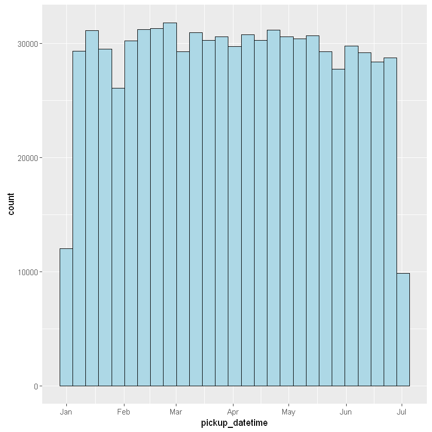
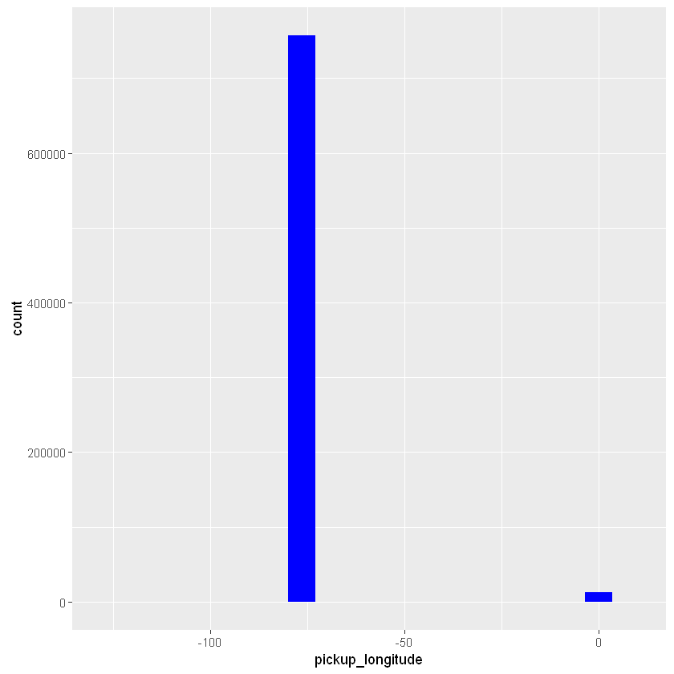
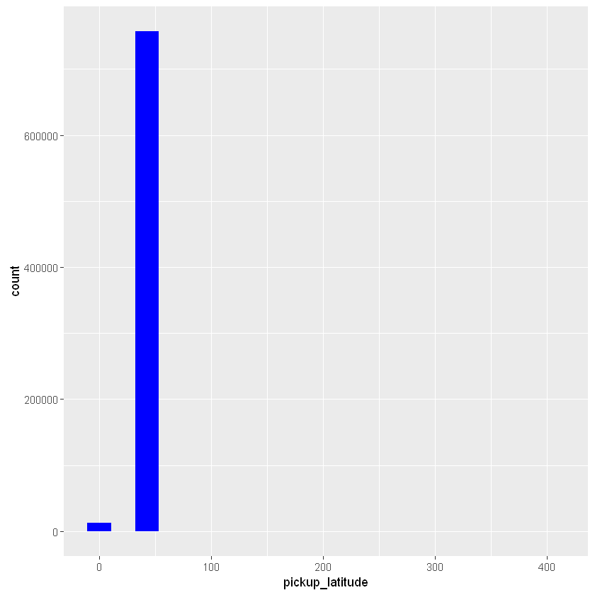

```{r setup, include=FALSE}
knitr::opts_chunk$set(echo = TRUE)
```

## Section 3: Cleaning the data

In the last section, we proposed ways that we could clean the data. In this section, we actually clean the data. Let's review where we are in the EDA (exploratory data analysis) process:

  1. load all the data (and combine them if necessary)
  2. inspect the data in preparation cleaning it
  3. **clean the data in preparation for analysis**
  4. add any interesting features or columns as far as they pertain to the analysis
  5. find ways to analyze or summarize the data and report your findings 


### Exercise 3.1

Run `summary` on the data.

```{r 3.01}
summary(nyc_taxi)
```

What are some important things we can tell about the data by looking at the above summary?

Discuss possible ways that some columns may need to be 'cleaned'. By 'cleaned' here we mean
  - reformatted into the appropriate type,
  - replaced with another value or an NA, 
  - removed from the data for the purpose of the analysis.

#### Solution to exercise 3.1

Here are some of the ways we can clean the data:

  - `tpep_pickup_datetime` and `tpep_dropoff_datetime` should be `datetime` columns, not `character`
  - `rate_code_id` and `payment_type` should be a `factor`, not `character`
  - the geographical coordinates for pick-up and drop-off occasionally fall outside a reasonable bound (probably due to error)
  - `fare_amount` is sometimes negative (could be refunds, could be errors, could be something else)

Some data-cleaning jobs depend on the analysis. For example, turning `payment_type` into a `factor` is unnecessary if we don't intend to use it as a categorical variable in the model. Even so, we might still benefit from turning it into a factor so that we can see counts for it when we run `summary` on the data, or have it show the proper labels when we use it in a plot. Other data-cleaning jobs on the other hand relate to data quality issues. For example, unreasonable bounds for pick-up or drop-off coordinates can be due to error. In such cases, we must decide whether we should clean the data by

 - removing rows that have incorrect information for some columns, even though other columns might still be correct
 - replace the incorrect information with NAs and decide whether we should impute missing values somehow
 - leave the data as is, but think about how doing so could skew some results from our analysis

---

Let's begin by dropping the columns we don't need (because they serve no purpose for our analysis).


```{r 3.02}
nyc_taxi$u <- NULL # drop the variable `u`
nyc_taxi$store_and_fwd_flag <- NULL
```

Next we format `tpep_pickup_date` and `tpep_dropoff_date` as datetime columns. There are different functions for dealing with datetime column types, including functions in the `base` package, but we will be using the `lubridate` package for its rich set of functions and simplicity.

```{r 3.03}
library(lubridate)
Sys.setenv(TZ = "US/Eastern") # not important for this dataset, but this is how we set the time zone
```

The function we need is called `ymd_hms`, but before we run it on the data let's test it on a string. Doing so gives us a chance to test the function on a simple input and catch any errors or wrong argument specifications.


```{r 3.04}
ymd_hms("2015-01-25 00:13:08", tz = "US/Eastern") # we can ignore warning message about timezones
```

We seem to have the right function and the right set of arguments, so let's now apply it to the data. If we are still unsure about whether things will work, it might be prudent to not immediately overwrite the existing column. We could either write the transformation to a new column or run the transformation on the first few rows of the data and just display the results in the console.


```{r 3.05}
ymd_hms(nyc_taxi$tpep_pickup_date[1:20], tz = "US/Eastern")
```

We now apply the transformation to the whole data and overwrite the original column with it.


```{r 3.06}
nyc_taxi$tpep_pickup_datetime <- ymd_hms(nyc_taxi$tpep_pickup_datetime, tz = "US/Eastern")
```

There's another way to do the above transformation: by using the `transform` function. Just as was the case with `subset`, `transform` allows us to pass the data as the first argument so that we don't have to prefix the column names with `nyc_taxi$`. The result is a cleaner and more readable notation.


```{r 3.07}
nyc_taxi <- transform(nyc_taxi, tpep_dropoff_datetime = ymd_hms(tpep_dropoff_datetime, tz = "US/Eastern"))
```

Let's also change the column names from `tpep_pickup_datetime` to `pickup_datetime` and `tpep_dropoff_datetime` to `dropoff_datetime`.


```{r 3.08}
names(nyc_taxi)[2:3] <- c('pickup_datetime', 'dropoff_datetime')
```

Let's now see some of the benefits of formatting the above columns as `datetime`. The first benefit is that we can now perform date calculations on the data. Say for example that we wanted to know how many data points are in each week. We can use `table` to get the counts and the `week` function in `lubridate` to extract the week (from 1 to 52 for a non-leap year) from `pickup_datetime`.


```{r 3.09}
table(week(nyc_taxi$pickup_datetime)) # `week`
```


```{r 3.10}
table(week(nyc_taxi$pickup_datetime), month(nyc_taxi$pickup_datetime)) # `week` and `month` are datetime functions
```


Another benefit of the `datetime` format is that plotting functions can do a better job of displaying the data in the expected format.# (2) many data summaries and data visualizations automatically 'look right' when the data has the proper format. We do not cover data visualization in-depth in this course, but we provide many examples to get you started. Here's a histogram of `pickup_datetime`.


```{r 3.11}
library(ggplot2)
ggplot(data = nyc_taxi) +
  geom_histogram(aes(x = pickup_datetime), col = "black", fill = "lightblue", 
                 binwidth = 60*60*24*7) # the bin has a width of one week
```


#### 3.11 Sample Output

---

Notice how the x-axis is properly formatted as a date without any manual input from us. Both the summary and the plot above would not have been possible if `pickup_datetime` was still a character column.


### Exercise 3.2

Next let's look at the longitude and latitude of the pick-up and drop-off locations.


```{r 3.12}
summary(nyc_taxi[ , grep('long|lat', names(nyc_taxi), value = TRUE)])
```

Take a look at the histogram for `pickup_longitude`:


```{r 3.13}
ggplot(data = nyc_taxi) +
  geom_histogram(aes(x = pickup_longitude), fill = "blue", bins = 20)
```

#### r3.13 Sample Output

---

We can see that most longitude values fall in the expected range, but there's a second peak around 0. There are also some other values outside of the expected range, but we can't see them in the histogram. We just know there are there because of the wide range (in the x-axis) of the histogram. 

(A) Plot a similar histogram for `dropoff_longitude` to see if it follows suit.

Let's learn about two useful R functions: 
  - `cut` is used to turn a numeric value into a categorical value by finding the interval that it falls into.  This is sometimes referred to as **binning** or **bucketing**.
  - `table` simply returns a count of each unique value in a vector.

For example, here we ask which bucket does 5.6 fall into?

  - 0 to 4 (including 4)
  - 4 to 10 (including 10)
  - higher than 10


```{r 3.14}
cut(5.6, c(0, 4, 10, Inf)) # 5.6 is in the range (4-10]
```


(4,10]


```{r 3.15}
table(c(1, 1, 2, 2, 2, 3)) # provides counts of each distinct value
```


    
    1 2 3 
    2 3 1 


Take a moment to familiarize yourself with both functions by modifying the above examples. We will be using both functions a few times throughout the course.

(B) Use `cut` to 'bucket' `pickup_longitude` into the following buckets: -75 or less, between -75 and -73, between -73 and -1, between -1 and 1, more than 1. Then `table` to get counts for each bucket.


#### Solution to exercise 3.2


```{r 3.16}
ggplot(data = nyc_taxi) +
  geom_histogram(aes(x = pickup_latitude), fill = "blue", bins = 20) # solution to (A)
```

#### r3.26 Sample Output

----


```{r 3.17}
bucket_boundaries <- c(-Inf, -75, -73, -1, 1, Inf)
table(cut(nyc_taxi$pickup_longitude, bucket_boundaries)) # solution to (B)
```


    
    (-Inf,-75]  (-75,-73]   (-73,-1]     (-1,1]   (1, Inf] 
             8     757355          2      13288          1 


---

It's time to clean the the longitude and latitude columns. We will do so by simply replacing the values that are outside of the acceptable range with NAs. NAs are the appropriate way to handle missing values in R. We are assuming that those values were mistakenly recorded and are as good as NAs. In some cases, this may not be a safe assumption.

To perform this transformation we use the `ifelse` function:
```
ifelse(condition, what_to_do_if_TRUE, what_to_do_if_FALSE)
```


```{r 3.18}
nyc_taxi$pickup_longitude <- ifelse(nyc_taxi$pickup_longitude < -75 | nyc_taxi$pickup_longitude > -73, 
                                    NA, # return NA when the condition is met
                                    nyc_taxi$pickup_longitude) # keep it as-is otherwise
```

We will do the other three transformations using the `transform` function instead, because it has a cleaner syntax and we can do multiple transformations at once.


```{r 3.19}
nyc_taxi <- transform(nyc_taxi, 
                      dropoff_longitude = ifelse(dropoff_longitude < -75 | dropoff_longitude > -73, NA, dropoff_longitude),
                      pickup_latitude = ifelse(pickup_latitude < 38 | pickup_latitude > 41, NA, pickup_latitude),
                      dropoff_latitude = ifelse(dropoff_latitude < 38 | dropoff_latitude > 41, NA, dropoff_latitude)
)
```

If we rerun `summary` we can see the counts for NAs as part of the summary now:


```{r 3.20}
summary(nyc_taxi[ , grep('long|lat', names(nyc_taxi), value = TRUE)])
```


     pickup_longitude pickup_latitude dropoff_longitude dropoff_latitude
     Min.   :-75      Min.   :38      Min.   :-75       Min.   :39      
     1st Qu.:-74      1st Qu.:41      1st Qu.:-74       1st Qu.:41      
     Median :-74      Median :41      Median :-74       Median :41      
     Mean   :-74      Mean   :41      Mean   :-74       Mean   :41      
     3rd Qu.:-74      3rd Qu.:41      3rd Qu.:-74       3rd Qu.:41      
     Max.   :-73      Max.   :41      Max.   :-73       Max.   :41      
     NA's   :13299    NA's   :13337   NA's   :12965     NA's   :13092   


### Exercise 3.3

A useful question we might want to ask is the following: Are longitude and latitude mostly missing as pairs? In other words, is it generally the case that when longitude is missing, so is latitude and vice versa?

Once missing values are formatted as NAs, we use the `is.na` function to determine what's an NA.


```{r 3.21}
is.na(c(2, 4, NA, -1, 5, NA))
```

Combine `is.na` and `table` to answer the following question:

(A) How many of the `pickup_longitude` values are NAs? (This was also answered when we ran `summary`.)
```{r 3.3 Exercise A}

```
(B) How many times are `pickup_longitude` and `pickup_latitude` missing together vs separately?
```{r 3.3 Exercise B}

```
(C) Of the times when the pair `pickup_longitude` and `pickup_latitude` are missing, how many times is the pair `dropoff_longitude` and `dropoff_latitude` also missing?
```{r 3.3 Exercise C}

```
#### Solution to exercise 3.3


```{r 3.22}
table(is.na(nyc_taxi$pickup_longitude)) # solution to (A)
```

```{r 3.23}
table(is.na(nyc_taxi$pickup_longitude) & is.na(nyc_taxi$pickup_latitude)) # solution to (B)
```

```{r 3.24}
table(is.na(nyc_taxi$pickup_longitude), is.na(nyc_taxi$pickup_latitude)) # better solution to (B)
```

```{r 3.25}
with(nyc_taxi,
     table(is.na(pickup_longitude) & is.na(pickup_latitude),
           is.na(dropoff_longitude) & is.na(dropoff_latitude))
) # solution to (C)
```

---

It's time to turn our attention to the categorical columns in the dataset. Ideally, categorical columns should be turned into `factor` (usually from `character` or `integer`), but let's first get a feel for what a `factor` is by working on the following exercise:


### Exercise 3.4

Let's create a sample with replacement of size 2000 from the colors red, blue and green. This is like reaching into a jar with three balls of each color, grabbing one and recording the color, placing it back into the jar and repeating this 2000 times.


```{r 3.26}
rbg_chr <- sample(c("red", "blue", "green"), 2000, replace = TRUE)
```

We add one last entry to the sample: the entry is 'pink':


```{r 3.27}
rbg_chr <- c(rbg_chr, "pink") # add a pink entry to the sample
```

We now turn `rbg_chr` (which is a character vector) into a `factor` and call it `rbg_fac`.  We then drop the 'pink' entry from both vectors.


```{r 3.28}
rbg_fac <- factor(rbg_chr) # turn `rbg_chr` into a `factor` `rbg_fac`
rbg_chr <- rbg_chr[1:(length(rbg_chr)-1)] # dropping the last entry from `rbg_chr`
rbg_fac <- rbg_fac[1:(length(rbg_fac)-1)] # dropping the last entry from `rbg_fac`
```

Note that `rbg_chr` and `rbg_fac` contain the same information, but are of different types. Discuss what differences you notice between `rbg_chr` and `rbg_fac` in each of the below cases:

(A) When we query the first few entries of each:


```{r 3.29}
head(rbg_chr)
```


```{r 3.30}
head(rbg_fac)
```

(B) When we compare the size of each in the memory:


```{r 3.31}
sprintf("Size as characters: %s. Size as factor: %s", 
        object.size(rbg_chr), object.size(rbg_fac))
```

(C) When we ask for counts within each category:

```{r 3.32}
table(rbg_chr); table(rbg_fac)
```

(D) when we try to replace an entry with something other than 'red', 'blue' and 'green':


```{r 3.33}
rbg_chr[3] <- "yellow" # replaces the 3rd entry in `rbg_chr` with 'yellow'
rbg_fac[3] <- "yellow" # throws a warning, replaces the 3rd entry with NA
```

Each category in a categorical column (formatted as `factor`) is called a factor level. We can look at factor levels using the `levels` function:


```{r 3.34}
levels(rbg_fac)
```

We can relabel the factor levels directly with `levels`:


```{r 3.35}
levels(rbg_fac) <- c('Blue', 'Green', 'Pink', 'Red') # we capitalize the first letters
head(rbg_fac)
```

We can add new factor levels to the existing ones:

```{r 3.36}
levels(rbg_fac) <- c(levels(rbg_fac), "Yellow") # we add 'Yellow' as a forth factor level
table(rbg_fac) # even though the data has no 'Yellow' entries, it's an acceptable value
```

Once new factor levels have been created, we can have entries which match the new level:

```{r 3.37}
rbg_fac[3] <- "Yellow" # does not throw a warning anymore
table(rbg_fac) # now the data has one 'Yellow' entry
```

Finally, we need to recreate the `factor` column if we want to drop a particular level or change the order of the levels.

```{r 3.38}
table(rbg_chr) # what we see in the orignal `character` column
```

If we don't provide the `factor` with levels (through the `levels` argument), we create a `factor` by scanning the data to find all the levels and sort the levels alphabetically.

```{r 3.39}
rbg_fac <- factor(rbg_chr)
table(rbg_fac)
```

We can overwrite that by explicitly passing factor levels to the `factor` function, in the order that we wish them to be. There are three important advantages to providing factor levels: 
  1. We can reorder the levels to any order we want (instead of having them alphabetically ordered). This way related levels can appear next to each other in summaries and plots.
  2. The factor levels don't have to be limited to what's in the data: we can provide additional levels that are not part of the data if we expect them to be part of future data. This way levels that are not in the data can still be represented in summaries and plots.
  3. Factor levels that are in the data, but not relevant to the analysis can be ignored (replaced with NAs) by not including them in `levels`. **Note that doing so results in information loss if we overwrite the original column.**


```{r 3.40}
rbg_fac <- factor(rbg_chr, levels = c('red', 'green', 'blue')) # create a `factor`, with only the levels provided, in the order provided
table(rbg_fac) # notice how 'yellow' has disappeared
```

```{r 3.41}
table(rbg_fac, useNA = "ifany") # 'yellow' was turned into an NA
```

#### Solution to exercise 3.4


```{r 3.4 Solution A}
# solution to (A)
head(rbg_chr) # we see quotes
head(rbg_fac) # we don't see quotes and we see the factor levels at the bottom
```

```{r 3.4 Solution B}
# solution to (B)
object.size(rbg_chr)
object.size(rbg_fac) # takes up less space in memory because factors are stored as integers under the hood
```

```{r 3.4 Solution C}
# solution to (C)
table(rbg_chr)
table(rbg_fac) # we can see a count of 0 for 'pink', becuase it's one of the factor levels
```

```{r 3.4 Solution C}
# solution to (D)
head(rbg_chr) # the 3rd entry changed to 'yellow'
head(rbg_fac) # we could not change the 3rd entry to 'yellow' because it's not one of the factor levels
```

---

The goal in the above exercise was to set the context for what factors are. Let's now turn our attention back to the data. A `factor` is the appropriate data type for a categorical column. When we loaded the data in R using `read.csv`, we set `stringsAsFactors = FALSE` to prevent any `character` columns from being turned into a factor. This is generally a good idea, becasue some character columns (such as columns with raw text in them or alpha-numeric ID columns) are not appropriate for factors. Accidentially turning such columns into factors can result in overhead, especially when data sizes are large. The overhead is the result of R having to keep a tally of all the factor levels. We do not have any `character` columns in this dataset that need to be coverted to factors, but we have `integer` columns that represent categorical data. These are the columns with low cardinality, as can be seen here:


```{r 3.46}
print(sapply(nyc_taxi, num.distinct))
```

Fortunately, the site that hosted the dataset also provides us with a [data dictionary](http://www.nyc.gov/html/tlc/downloads/pdf/data_dictionary_trip_records_yellow.pdf). Going over the document helps answer what the categorical columns are and what each category represents.

For example, for `rate_code_id`, the mapping is as follows:
 - 1 = Standard rate
 - 2 = JFK
 - 3 = Newark
 - 4 = Nassau or Westchester
 - 5 = Negotiated fare
 - 6 = Group ride

The above information helps us properly label the factor levels.

Notice how `summary` shows us numeric summaries for the categorical columns right now.

```{r 3.47}
summary(nyc_taxi[ , c('rate_code_id', 'payment_type')]) # shows numeric summaries for both columns
```

A quick glance at `payment_type` shows two payments as by far the most common. The data dictionary confirms for us that they correspond to card and cash payments.


```{r 3.48}
table(nyc_taxi$payment_type)
```

We now turn both `rate_code_id` and `payment_type` into `factor` columns. For `rate_code_id` we keep all the labels, but for `payment_type` we only keep the two most common and label them as 'card' and 'cash'.  We do so by specifying `levels = 1:2` instead of `levels = 1:6` and provide labels for only the first two categories. This means the other values of `payment_type` get lumped together and replaced with NAs, resulting in information loss (which we are comfortable with, for the sake of this analysis).


```{r 3.49}
nyc_taxi <- transform(nyc_taxi, 
                      rate_code_id = factor(rate_code_id, 
                                            levels = 1:6, labels = c('standard', 'JFK', 'Newark', 'Nassau or Westchester', 'negotiated', 'group ride')),
                      payment_type = factor(payment_type,
                                            levels = 1:2, labels = c('card', 'cash')
                      ))
```


```{r 3.50}
head(nyc_taxi[ , c('rate_code_id', 'payment_type')]) # now proper labels are showing in the data
```

```{r 3.51}
summary(nyc_taxi[ , c('rate_code_id', 'payment_type')]) # now counts are showing in the summary
```

It is very important that the `labels` be in the same order as the `levels` they map into.

What about `passenger_count`? should it be treated as a `factor` or left as integer? The answer is it depends on how it will be used, especially in the context of modeling. Most of the time, such a column is best left as `integer` in the data and converted into factor 'on-the-fly' when need be (such as when we want to see counts, or when we want a model to treat the column as a `factor`).

Our data-cleaning is for now done. We are ready to now add new features to the data, but before we do so, let's briefly revisit what we have so far done from the beginning, and see if we could have taken any shortcuts. That is the subject of the next chapter.