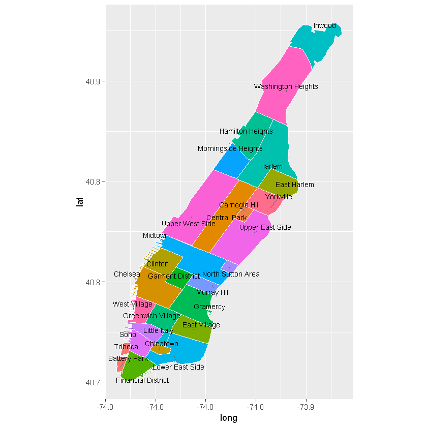
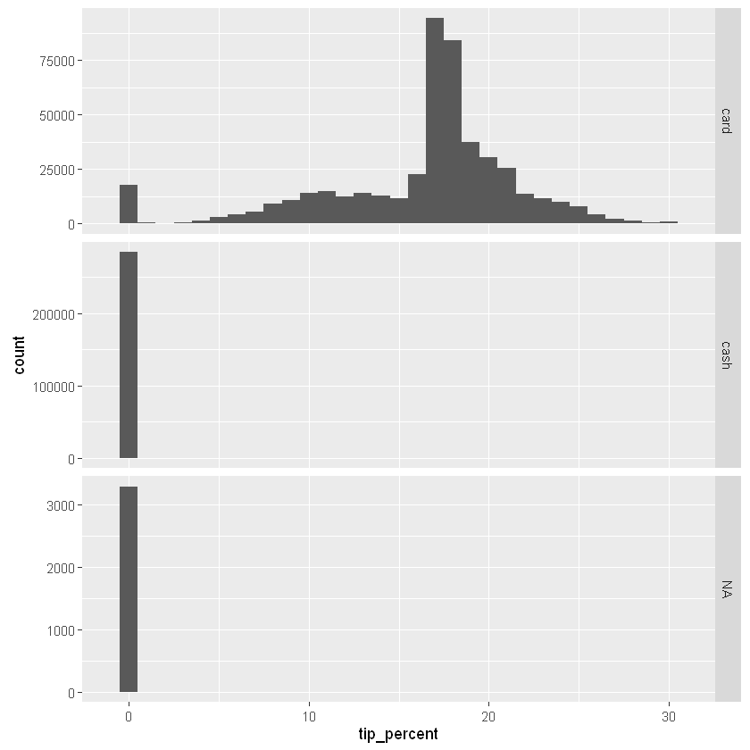
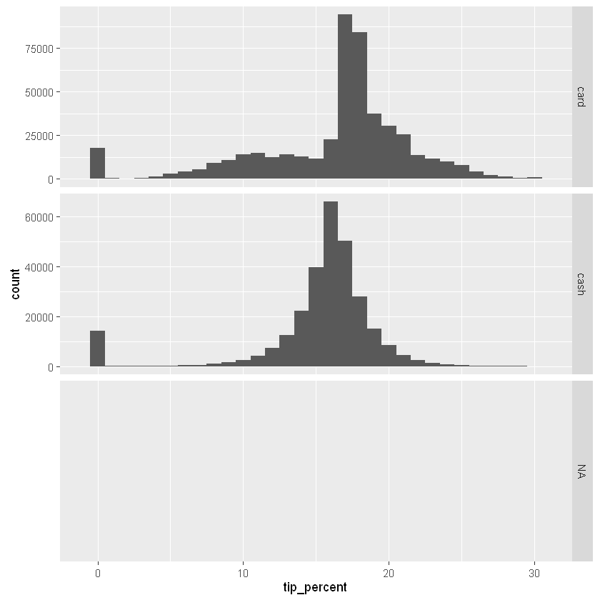
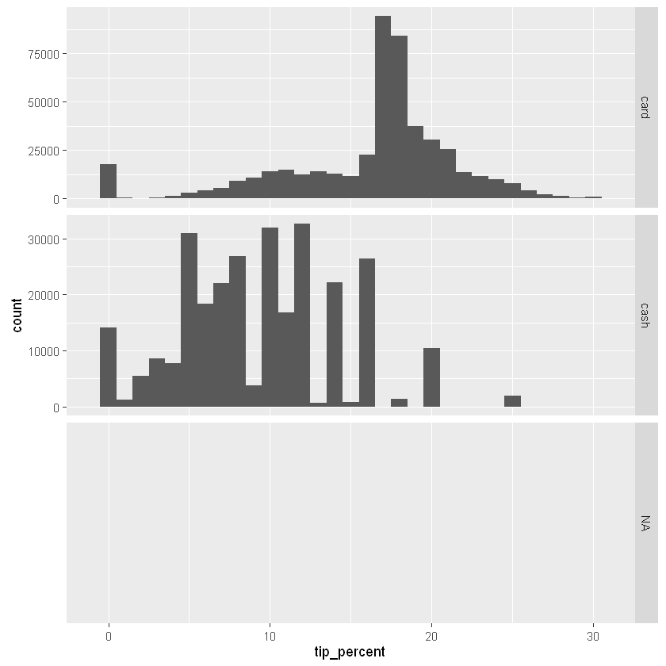

```{r setup, include=FALSE}
knitr::opts_chunk$set(echo = TRUE)
```

## Section 5: Creating new features

Features extraction is the process of creating new (and interesting) columns in our data out of the existing columns. Sometimes new features can be directly extracted from one of several columns in the data. For example, we can extract the day of the week from `pickup_datetime` and `dropoff_datetime`. Sometimes new features rely on third-party data. For example, we could have a `holiday_flag` column to know which dates were holidays.

### Exercise 5.1

Let's take a look at the data as it now stands.


```{r 5.01}
head(nyc_taxi)
```

Discuss possible 'features' (columns) that we can extract from already existing columns. Recall that our goal is to tell interesting (unexpected, or not immediately obvious) stories based on the data, so think of features that would make this dataset more interesting to analyze and the story more compelling.

---

The first set of features we extract are date and time related features. Specifically, we would like to know the day of the week and the time of the day (based on our own cutoffs).


```{r 5.02}
library(dplyr)
library(lubridate)
weekday_labels <- c('Sun', 'Mon', 'Tue', 'Wed', 'Thu', 'Fri', 'Sat')
cut_levels <- c(1, 5, 9, 12, 16, 18, 22) # used to bucket hour of day into
hour_labels <- c('1AM-5AM', '5AM-9AM', '9AM-12PM', '12PM-4PM', '4PM-6PM', '6PM-10PM', '10PM-1AM')
nyc_taxi <- mutate(nyc_taxi, 
                   pickup_hour = addNA(cut(hour(pickup_datetime), cut_levels)),
                   pickup_dow = factor(wday(pickup_datetime), levels = 1:7, labels = weekday_labels),
                   dropoff_hour = addNA(cut(hour(dropoff_datetime), cut_levels)),
                   dropoff_dow = factor(wday(dropoff_datetime), levels = 1:7, labels = weekday_labels),
                   trip_duration = as.integer(as.duration(dropoff_datetime - pickup_datetime))
)
levels(nyc_taxi$pickup_hour) <- hour_labels
levels(nyc_taxi$dropoff_hour) <- hour_labels
head(nyc_taxi)
```

The next set of features we extract from the data are geospatial features, for which we load the following geospatial packages:

```{r 5.03}
library(rgeos)
library(sp)
library(maptools)
```

It is common to store GIS data in R into **shapefiles**. A shapefile is essentially a data object that stores geospatial informaiton such as region names and boundaries where a region can be anything from a continent to city neighborhoods. The shapefile we use here was provided by Zillow.com and can be found [here](http://www.zillow.com/howto/api/neighborhood-boundaries.htm). It is a shapefile for the state of New York, and it contains neighborhood-level information for New York City.

```{r 5.04}
nyc_shapefile <- readShapePoly('C:\\data\\NYC_Taxi\\ZillowNeighborhoods-NY\\ZillowNeighborhoods-NY.shp')
```

We can see what sort of information is available by peeking at `nyc_shapefile@data`:


```{r 5.05}
head(nyc_shapefile@data, 10)
```

The data stores information about neighborhoods under the column `NAME`. Since we have longitude and latitude for pick-up and drop-off location, we can use the above data set to find the pick-up and drop-off neighborhoods for each cab ride. To keep the analysis simple, we limit the data to Manhattan only, where the great majority of cab rides take place.


```{r 5.06}
nyc_shapefile <- subset(nyc_shapefile, COUNTY == 'New York') # limit the data to Manhattan only
```

Notice that even though `nyc_shapefile` is not a `data.frame`, `subset` still worked. This is because subset is a function that works on more than just one kind of input. Quite a few R functions are the same way, such as `plot` and `predict`.

With a bit of work, we can plot a map of the whole area, showing the boundaries separating each neighborhood. We won't go into great detail on how the plots are generated, as it would derail us from the main topic.


```{r 5.07}
library(ggplot2)
nyc_shapefile@data$id <- as.character(nyc_shapefile@data$NAME)
nyc_points <- fortify(gBuffer(nyc_shapefile, byid = TRUE, width = 0), region = "NAME") # fortify neighborhood boundaries
```

As part of the code to create the plot, we use `dplyr` to summarize the data and get median coordinates for each neighborhood, but since we revisit `dplyr` in greater depth in the next section, we skip the explanation for now.


```{r 5.08}
library(dplyr)
nyc_df <- inner_join(nyc_points, nyc_shapefile@data, by = "id")
nyc_centroids <- summarize(group_by(nyc_df, id), long = median(long), lat = median(lat))

library(ggrepel)
library(ggplot2)
ggplot(nyc_df) + 
  aes(long, lat, fill = id) + 
  geom_polygon() +
  geom_path(color = "white") +
  coord_equal() +
  theme(legend.position = "none") +
  geom_text_repel(aes(label = id), data = nyc_centroids, size = 3)
```

####{r 5.08 Sample Output}

---

We now go back to the data to find the neighborhood information based on the pickup and dropoff coordinates. We store pickup longitude and latitude in a separate `data.frame`, replacing NAs with zeroes (the function we're about to use doesn't work with NAs). We then use the `coordinates` function to point to the columns that correspond to the geographical coordinates. Finally, we use the `over` function to find the region (in this case the neighborhood) that the coordinates in the data fall into, and we append the neighborhood name as a new column to the `nyc_taxi` dataset.


```{r 5.09}
data_coords <- data.frame(
  long = ifelse(is.na(nyc_taxi$pickup_longitude), 0, nyc_taxi$pickup_longitude), 
  lat = ifelse(is.na(nyc_taxi$pickup_latitude), 0, nyc_taxi$pickup_latitude)
)
coordinates(data_coords) <- c('long', 'lat') # we specify the columns that correspond to the coordinates
# we replace NAs with zeroes, becuase NAs won't work with the `over` function
nhoods <- over(data_coords, nyc_shapefile) # returns the neighborhoods based on coordinates
nyc_taxi$pickup_nhood <- nhoods$NAME # we attach the neighborhoods to the original data and call it `pickup_nhood`
```

We can use `table` to get a count of pick-up neighborhoods:


```{r 5.10}
head(table(nyc_taxi$pickup_nhood, useNA = "ifany"))
```


We now repeat the above process, this using dropo-ff coordinates this time to get the drop-off neighborhood.


```{r 5.11}
data_coords <- data.frame(
  long = ifelse(is.na(nyc_taxi$dropoff_longitude), 0, nyc_taxi$dropoff_longitude), 
  lat = ifelse(is.na(nyc_taxi$dropoff_latitude), 0, nyc_taxi$dropoff_latitude)
)
coordinates(data_coords) <- c('long', 'lat')
nhoods <- over(data_coords, nyc_shapefile)
nyc_taxi$dropoff_nhood <- nhoods$NAME
```

And since data_coords and nhoods are potentially large objects, we remove them from our session when they're no longer needed.


```{r 5.12}
rm(data_coords, nhoods) # delete these objects, as they are no longer needed
```

Note how we had to repeat the same process in two different steps, once to get pick-up and once to get drop-off neighborhoods. Now if we need to change something about the above code, we have to change it in two different places. For example, if we want to reset the factor levels so that only Manhattan neighborhoods are showing, we need to remember to do it twice.

Another downside is we ended up with leftover objects `data_coords` and `nhood`. Since both objects have the same number of rows as the `nyc_taxi` dataset, they are relatively large objects, so we manually deleted them from the R session using `rm` after we finished using them. Carrying around too many by-product objects in the R session that are no longer needed can result in us clogging the memory, especially if the objects take up a lot of space. So we need to be careful and do some housecleaning every now and then so our session remains clean. Doing so is easier said than done.

There is however something we can do to avoid both of the above headaches: wrap the process into an R function.


### Exercise 5.2

(A) Conceptually describe the function we described in the above section, in other words
  - what would be the input(s) to the function?
  - what would the function return as output?
  - what are the intermediate results that are created by the function?
```{r 5.2 Exercise A}

```


(B) Here's a basic user-defined R function:


```{r 5.2 Exercise B - Figure 1}
p <- 5
do.something <- function(n, d) {
  m <- n + p
  return(m/d)
}
```

  - What is the name of the function?
  - What are the function's arguments?
  - What are the local and global variables?
  - What is the 'body' of the function?
  - What does the function return?
  - What happens to `m` and `d` (local variables) once the function finishes running?

Try to preduct what the function returns in the two cases here:


```{r 5.2 Exercise B - Figure 2}
do.something(10, 3)
p <- 8
do.something(10, 3)
```

```{r 5.2 Exercise B}

```


(C) Change the above function so that `p` is always 5 for the function. There is more than one way to do this.
```{r 5.2 Exercise C}

```


#### Solution to exercise 5.2

Here's the solution to part (C). As we mentioned, there's more than one way of doing this. One way is to turn `p` into an argument for the function `do.something`, with the default value set to 5.


```{r 5.2 Solution C.1}
do.something <- function(n, d, p = 5) {
  m <- n + p
  return(m/d)
}
```

Another approach is to make `p` a local variable, instead of a global variable. When the function runs, regardless of what `p` is assigned to globally, `p` will always be assinged the value 5 in the function's environment.


```{r 5.2 Solution C.2}
do.something <- function(n, d) {
  p <- 5
  m <- n + p
  return(m/d)
}

p <- 8
do.something(10, 3)
```


5


---

With the last exercise as introduction, believe it or not, we know everything we need to know to accomplish the automation task we set out to do. We already have the bulk of the code that the function relies on, so it's often a matter of pasting it into the body of the function and making some minor changes. To write good functions, we often begin by writing code that works, then we identify the need for automation (to reuse code, to automatically clean intermediate results), and finally we wrap the code around a function and modify and test it to make sure it still works.

Of course writing good functions can be more involved than what we described here. This is especially so when we write functions that we intend to use across multiple projects or share with others. In such cases, we often spend more time anticipating all the ways that the function could break given different inputs and try to account for such cases.

With the last exercise as a backdrop, let's now delete `pickup_nhood` and `dropoff_nhood` from the data and recreate those columns, this time by writing a function.


```{r 5.17}
nyc_taxi$pickup_nhood <- NULL # we drop this column so we can re-create it here
nyc_taxi$dropoff_nhood <- NULL # we drop this column so we can re-create it here
```

We call the function `add.neighborhoods`. Its inputs are the dataset, the names of the longitude and latitude coordinates (as strings), and the shapefile. The output we return is a single column containing the neighborhoods names.


```{r 5.18}
add.neighborhoods <- function(data, long_var, lat_var, shapefile) {
  data_coords <- data[ , c(long_var, lat_var)] # create `data.frame` with only those two columns
  names(data_coords) <- c('long', 'lat') # rename the columns to `long` and `lat`
  data_coords <- mutate(data_coords, long = ifelse(is.na(long), 0, long), lat = ifelse(is.na(lat), 0, lat)) # replace NAs with 0
  coordinates(data_coords) <- c('long', 'lat') # designate the columns as geographical coordinates
  nhoods <- over(data_coords, nyc_shapefile) # find the neighborhoods the coordinates fall into
  nhoods$NAME <- factor(nhoods$NAME, levels = as.character(nyc_shapefile@data$NAME)) # reset factor levels to Manhattan only
  return(nhoods$NAME) # return only the column with the neighborhoods
}
```

We can now use our function twice. Once to find the pick-up neighborhood:


```{r 5.19}
nyc_taxi$pickup_nhood <- add.neighborhoods(nyc_taxi, 'pickup_longitude', 'pickup_latitude', nyc_shapefile)
table(nyc_taxi$pickup_nhood, useNA = "ifany")
```


And a second time to find the drop-off neighborhood:


```{r 5.20}
nyc_taxi$dropoff_nhood <- add.neighborhoods(nyc_taxi, 'dropoff_longitude', 'dropoff_latitude', nyc_shapefile)
table(nyc_taxi$dropoff_nhood, useNA = "ifany")
```


### Exercise 5.3

Let's revisit the function we defined in the last exercise:


```{r 5.21}
p <- 5
do.something <- function(n, d) {
  m <- n + p
  m/d
}
```

(A) Is the function 'vectorized'? i.e. if the input(s) is a vector are the outputs also vectors? Show by example. This question is not trivial, because vectorized functions can be used directly for column transformations (after all, columns in a `data.frame` are just vectors).
```{r 5.3 Exercise A}

```

(B) Based on what we leared about vectorized functions, is the `ifelse` function vectorized? what about `if` and `else`? Once again answer the question using examples for each.
```{r 5.3 Exercise B}

```

#### Solution to exercise 5.3

For part (A) instead of feeding single numbers as inputs to the function, we try an `integer` vector instead. Since the function has two inputs, we can try an `integer` vector as the first input (and singleton as the second), vice versa, or `integer` vectors for both inputs.


```{r 5.3 Solution A.1}
do.something(10, 3) # singleton inputs
```

```{r 5.3 Solution A.2}
do.something(1:10, 3) # first input is a vector, output is also a vector
```

```{r 5.3 Solution A.3}
do.something(1:10, seq(1, 20, by = 2)) # both inputs are vectors, as is the output
```

For part (B), here's how we can show that `ifelse` is vectorized:


```{r 5.3 Solution B}
ifelse(2 > 1, 55, 0) # singleton condition and output
```

```{r 5.3 Solution B.2}
ifelse(0:5 > 1, 55, 0) # condition is vector, so is the output
```

```{r 5.3 Solution B.3}
ifelse(0:5 > 1, letters[1:6], LETTERS[1:6]) # all inputs are vectors, so is the output
```


However, `if` and `else` are not vectorized functions, as can be seen by the following example:


```{r 5.3 Solution B.4}
if(2 > 1) 55 else 0 # singleton condition works fine
```

```{r 5.3 Solution B.5}
if(0:5 > 1) 55 else 0 # vector of conditions does not work (only the first element) is considered
```


This means that we generally use `ifelse` when we need to transform the data (e.g. create a new column) based on conditional statements, whereas we use `if` and `else` when we need to check a single condition, such as this:

```{r 5.3 Solution B.6}
if(file.exists("NYC_Sample.csv")) sprintf("%s/%s exists.", getwd(), "NYC_Sample.csv")
```

---

When processing a `data.frame` with R, vectorized functions show up in many places. Without them, our R code would be more verbose, and often (though not always) less efficient. Let's look at another example of this by looking at the relationship between tipping and method of payment.

First we calculate the tipping percentage for every trip.


```{r 5.31}
nyc_taxi <- mutate(nyc_taxi, tip_percent = as.integer(tip_amount / (tip_amount + fare_amount) * 100))
table(nyc_taxi$tip_percent, useNA = "ifany")
```


The table of counts are useful, but it might be easier for us to see the distribution if we plot the histogram. And since there's a good chance that method of payment affects tipping, we break up the histogram by `payment_type`.


```{r 5.32}
library(ggplot2)
ggplot(data = nyc_taxi) +
  geom_histogram(aes(x = tip_percent), binwidth = 1) + # show a separate bar for each percentage
  facet_grid(payment_type ~ ., scales = "free") + # break up by payment type and allow different scales for 'y-axis'
  xlim(c(-1, 31)) # only show tipping percentages between 0 and 30
```





The histogram confirms what we suspected: tipping is affected by the method of payment. However, it is unlikely to believe that people who pay cash simply don't tip. A more believable scenario is that cash customers tip too, but their tip does not get recorded into the system as tip. In the next exercise, we try our hand at simulating tipping behavior for cash customers.

### Exercise 5.4

Let's assume that most cash customers tip (but the amount they tip does not show in the data). We further assume that tipping behavior for cash vs card customers is very different in the following way:
  - card customers might tip based on a certain percentage (automatically calculated when they swipe)
  - cash customers might tip by rounding up (and thereby avoid getting small change)

For example, a card customer could tip 10 percent regardless of the fare amount, but a cash cusmer whose fare is \$4.65 would round up to \$6, and if the fare is \$26.32 they would round up to \$30. So the cash customer's tip is also proportional to the fare amount, but partly driven by the need to avoid getting change or doing the math. We want to find a way to simulate this behavior.

In other words, we want to write a function that calculates tip by *rounding up* the fare amount. Writing such a function from scratch is a little tedious. Fortunately, there is already a function in `base` R to help us:


```{r 5.33}
findInterval(3.66, c(1, 3, 4.5, 6, 10))
```

Take a moment to inspect and familiarize yourself with the above function: 
  - What does the above function return?
  - What are some ways the function could 'misbehave'? In other words, check what the function returns when odd inputs are provided, including NAs.


```{r 5.34}
findInterval(NA, c(1, 3, 4.5, 6, 10))
```

Let's break up the above code into two parts:


```{r 5.35}
upper_limits <- c(1, 3, 4.5, 6, 10)
findInterval(3.66, upper_limits)
```

(A) Modify the last line so that we return the first number higher than the number we provide. In this case: the number we provide is 3.66, the first number higher than 3.66 is 4.5, so modify the code to return 4.5 only. (HINT: think of the line as the index to another vector.)
```{r 5.3 Exercise A}

```

(B) Is the function `findInterval` vectorized? show by example.
```{r 5.3 Exercise B}

```

(C) Wrap the above solution into a function called `round.up.fare` and test it with the following input:
sample_of_fares <- c(.55, 2.33, 4, 6.99, 15.20, 18, 23, 44)
```{r 5.3 Exercise C}

```
#### Solution to exercise 5.4


```{r 5.3 Solution A}
upper_limits[findInterval(0, upper_limits) + 1] # solution to (A)
```

The problem reduces to finding out if `findInterval` is vectorized.


```{r 5.3 Solution B}
upper_limits[findInterval(1:5, upper_limits) + 1] # solution to (B)
```

Making a function out of the code we developed is almost trivial:


```{r 5.3 Solution C}
round.up.fare <- function(x, ul = upper_limits) {
  upper_limits[findInterval(x, upper_limits) + 1]
}

sample_of_fares <- c(.55, 2.33, 4, 6.99, 15.20, 18, 23, 44)
round.up.fare(sample_of_fares)
```

---

Instead of ignoring tip amount for customers who pay cash, or pretending that it's really zero, in the last exercise we wrote a function that uses a simple rule-based approach to find how much to tipping. In the next exercise, we apply the function to the dataset. But before we do that, let's use an alternative approach to the rule-based method: Let's use a statistical technique to estimate tipping behavior, here's one naive way of doing it:

Since even among card-paying customers, a small proportion don't tip, we can toss a coin and do as follows:
  - With 5 percent probability the customer does not tip
  - With 95 percent probability the customer tips, and the tip is a certain percentage of the fare amount and a random component. More specifically, the tip is determined by drawing from a normal distribution centered around 20 percent of the fare amount with a standard deviation of 25 cents.
  
Here's how we can apply the above logic to the dataste:


```{r 5.39}
nyc_taxi <- mutate(nyc_taxi, 
                   toss_coin = rbinom(nrow(nyc_taxi), 1, p = .95), # toss a coin
                   tip_if_heads = rnorm(nrow(nyc_taxi), mean = fare_amount * 0.20, sd = .25),
                   tip_if_tails = 0, # if tails don't tip
                   tip_amount = 
                     ifelse(payment_type == 'cash', 
                            ifelse(toss_coin, tip_if_heads, tip_if_tails), # when payment method is cash apply the above rule
                            ifelse(payment_type == 'card', tip_amount, NA)), # otherwise just use the data we have
                   tip_percent = as.integer(tip_amount / (tip_amount + fare_amount) * 100), # recalculate tip percentage
                   toss_coin = NULL, # drop variables we no longer need
                   tip_if_heads = NULL,
                   tip_if_tails = NULL)
```

Let's visualize the percentage tipped to for card and cash customers now.


```{r 5.40}
library(ggplot2)
ggplot(data = nyc_taxi) +
  geom_histogram(aes(x = tip_percent), binwidth = 1) + # show a separate bar for each percentage
  facet_grid(payment_type ~ ., scales = "free") + # break up by payment type and allow different scales for 'y-axis'
  xlim(c(-1, 31)) # only show tipping percentages between 0 and 30
```





### Exercise 5.5

Here's the function we created in the last exercise:


```{r 5.41}
round.up.fare <- function(x, ul) {
  # `x` is a vector of numeric values
  # `ul` is a vector of upper limits we want to round up to, must be sorted
  # returns the smallest number in `ul` larger than `x` (and NA if `x > max(ul)`)
  ul[findInterval(x, ul) + 1]
}
fare_intervals <- c(0:10, seq(12, 20, by = 2), seq(25, 50, by = 5), seq(55, 100, by = 10))
round.up.fare(23, fare_intervals)
```

In this exercise, we replace the statistical approach to simulating `tip_amount` for the cash customers with the rule-based approach implemented in the above function. In the data transformation above (under `nyc_taxi <- mutate(...)`), replace the line `tip_if_heads = rnorm(...)` with the transformation corresponding to the rule-based approach, as implemented by `round.up.fare`. Run the new transformaiton and recreate the plot, comment on the new distribution.
``` {r 5.5 Exercise A}

```

#### Solution to exercise 5.5

Just replace `tip_if_heads = rnorm(nrow(nyc_taxi), mean = fare_amount * 0.20, sd = .25)` with `tip_if_heads = round.up.fare(fare_amount, fare_intervals) - fare_amount` and rerun the whole code chunk and the one after it for recreating the plot.


```{r 5.5 Solution A}
nyc_taxi <- mutate(nyc_taxi, 
                   toss_coin = rbinom(nrow(nyc_taxi), 1, p = .95), # toss a coin
                   tip_if_heads = round.up.fare(fare_amount, fare_intervals) - fare_amount,
                   tip_if_tails = 0, # if tails don't tip
                   tip_amount = 
                     ifelse(payment_type == 'cash', 
                            ifelse(toss_coin, tip_if_heads, tip_if_tails), # when payment method is cash apply the above rule
                            ifelse(payment_type == 'card', tip_amount, NA)), # otherwise just use the data we have
                   tip_percent = as.integer(tip_amount / (tip_amount + fare_amount) * 100), # recalculate tip percentage
                   toss_coin = NULL, # drop variables we no longer need
                   tip_if_heads = NULL,
                   tip_if_tails = NULL)

library(ggplot2)
ggplot(data = nyc_taxi) +
  geom_histogram(aes(x = tip_percent), binwidth = 1) + # show a separate bar for each percentage
  facet_grid(payment_type ~ ., scales = "free") + # break up by payment type and allow different scales for 'y-axis'
  xlim(c(-1, 31)) # only show tipping percentages between 0 and 30
```
---

##### {r 5.5 Solution A Sample Output}

--

We now have a data set that's more or less ready for analysis. In the next section we go over ways we can summarize the data and produce plots and tables. Let's run `str(nyc_taxi)` and `head(nyc_taxi)` again to review all the work we did so far.


```{r 5.43}
str(nyc_taxi)
```


```{r 5.44}
head(nyc_taxi)
```


