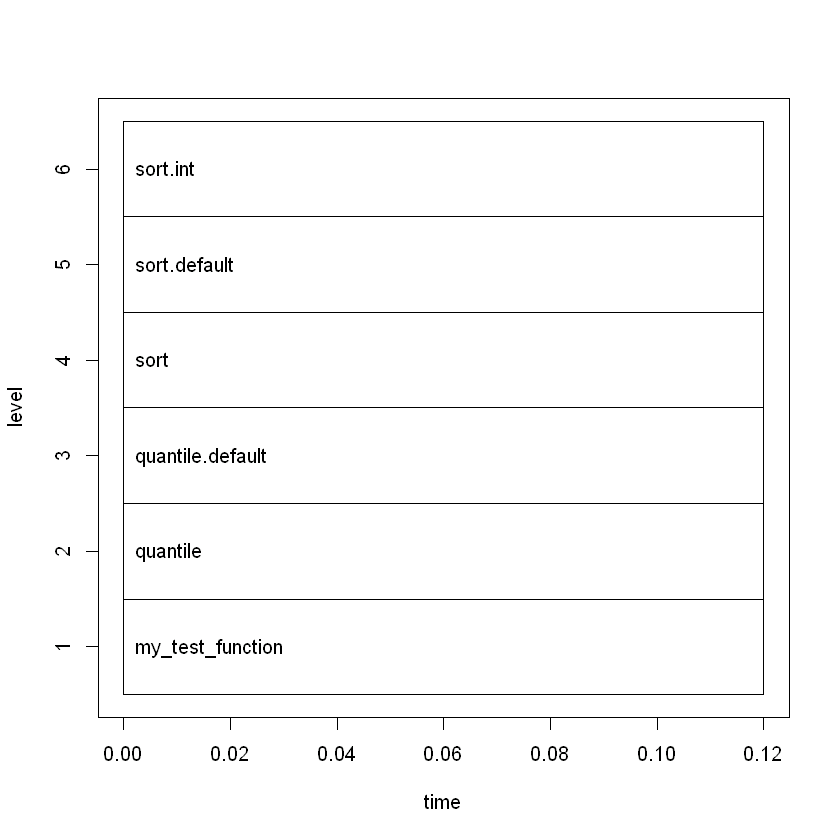

```{r setup, include=FALSE}
knitr::opts_chunk$set(echo = TRUE)
```

## Section 6: Data summary and analysis

Let's recap where we are in the process:

  1. load all the data (and combine them if necessary)
  2. inspect the data in preparation cleaning it
  3. clean the data in preparation for analysis
  4. add any interesting features or columns as far as they pertain to the analysis
  5. **find ways to analyze or summarize the data and report your findings**

We divide this section into three subsections:
  1. **Overview of some important statistical summary functions:** This is by no means a comprehensive glossary of statistical functions, but rather a sampling of the important ones and how to use them, how to modify them, and some common patterns among them.
  2. **Data summary with `base` R tools:** The `base` R tools for summarizing data are a bit more tedious and some have a different notation or way of passing arguments, but they are also widely used and they can be very efficient if used right.
  3. **Data summary with `dplyr`:** `dplyr` offers a consistent and popular notation for processing and summarizing data, and one worth learning on top of `base` R.

To reiterate, statistical summary functions which we cover in subsection (1) can be used in either of the above cases, but what's different is the way we query the data using those functions. For the latter, we will review two (mostly alternative) ways: one using `base` functions in sebsection (2) and one using the `dplyr` library in sebsection (3).

## Subsection 1: Statistical summary functions

We already learned of one all-encompassing summary function, namely `summary`:


```{r 6.01}
summary(nyc_taxi) # summary of the whole data
```


We can use `summary` to run a sanity check on the data and find ways that the data might need to be cleaned in preparation for analysis, but we are now interested in individual summaries. For example, here's how we can find the average fare amount for the whole data.


```{r 6.02}
mean(nyc_taxi$fare_amount) # the average of `fare_amount`
```

By specifying `trim = .10` we can get a 10 precent trimmed average, i.e. the average after throwing out the top and bottom 10 percent of the data:


```{r 6.03}
mean(nyc_taxi$fare_amount, trim = .10) # trimmed mean
```

By default, the `mean` function will return NA if there is any NA in the data, but we can overwrite that with `na.rm = TRUE`. This same argument shows up in almost all the statistical functions we encounter in this section.

```{r 6.04}
mean(nyc_taxi$trip_duration) # NAs are not ignored by default
```

```{r 6.05}
mean(nyc_taxi$trip_duration, na.rm = TRUE) # removes NAs before computing the average
```


### Exercise 6.1.1

The `trim` argument for the `mean` function is two-sided. Let's build a one-sided trimmed mean function, and one that uses counts instead of percentiles. Call it `mean.minus.top.n`. For example `mean.minus.top.n(x, 5)` will throw out the highest 5 values of `x` before computing the average. HINT: you can sort `x` using the `sort` function.
``` {r 6.1 Exercise A}

```

#### Solution to exercise 6.1.1


```{r 6.1.1 Solution A}
mean.minus.top.n <- function(x, n) {
  mean(-sort(-x)[-(1:n)], na.rm = TRUE)
}
mean.minus.top.n(c(1, 5, 3, 99), 1)
```

---

We can use `weighted.mean` to find a weighted average. The weights are specified as the second argument, and if we fail to specify anything for weights, we just get a simple average.


```{r 6.07}
weighted.mean(nyc_taxi$tip_percent, na.rm = TRUE) # simple average
```

```{r 6.08}
weighted.mean(nyc_taxi$tip_percent, nyc_taxi$trip_distance, na.rm = TRUE) # weighted average
```

The `sd` function returns the standard deviation of the data, which is the same as returning the square root of its variance.


```{r 6.09}
sd(nyc_taxi$trip_duration, na.rm = TRUE) # standard deviation
```

```{r 6.10}
sqrt(var(nyc_taxi$trip_duration, na.rm = TRUE)) # standard deviation == square root of variance
```

We can use `range` to get the minimum and maximum of the data at once, or use `min` and `max` individually.

```{r 6.11}
range(nyc_taxi$trip_duration, na.rm = TRUE) # minimum and maximum
```


```{r 6.12}
c(min(nyc_taxi$trip_duration, na.rm = TRUE), max(nyc_taxi$trip_duration, na.rm = TRUE))
```

We can use `median` to return the median of the data.


```{r 6.13}
median(nyc_taxi$trip_duration, na.rm = TRUE) # median
```

The `quantile` function is used to get any percentile of the data, where the percentile is specified by the `probs` argument. For example, letting `probs = .5` returns the median.

```{r 6.14}
quantile(nyc_taxi$trip_duration, probs = .5, na.rm = TRUE) # median == 50th percentile
```

We can specify a vector for `probs` to get multiple percentiles all at once. For example setting `probs = c(.25, .75)` returns the 25th and 75th percentiles.

```{r 6.15}
quantile(nyc_taxi$trip_duration, probs = c(.25, .75), na.rm = TRUE) # IQR == difference b/w 75th and 25th percentiles
```

The difference between the 25th and 75th percentiles is called the inter-quartile range, which we can also get using `IQR`.

```{r 6.16}
IQR(nyc_taxi$trip_duration, na.rm = TRUE) # interquartile range
```

### Exercise 6.1.2

We just leared that the `probs` argument of `quantile` can be a vector. So instead of getting multiple quantiles separately, such as

```{r 6.17}
c(quantile(nyc_taxi$trip_distance, probs = .9),
  quantile(nyc_taxi$trip_distance, probs = .6),
  quantile(nyc_taxi$trip_distance, probs = .3))
```

we can get them all at once by passing the percentiles we want as a single vector to `probs`:

```{r 6.18}
quantile(nyc_taxi$trip_distance, probs = c(.3, .6, .9))
```

As it turns out, there's a considerable difference in efficiency between the first and second approach. We explore this in this exercise:

There are two important tools we can use when considering efficiency:
  - **profiling** is a helpful tool if we need to understand what a function does under the hood (good for finding bottlenecks)
  - **benchmarking** is the process of comparing multiple functions to see which is faster
Both of these tools can be slow when working with large datasets (especially the benchmarking tool), so instead we create a vector of random numbers and use that for testing (alternatively, we could use a sample of the data). We want the vector to be big enough that test result are stable (not due to chance), but small enough that they will run within a reasonable time frame.

```{r 6.19}
random.vec <- rnorm(10^6) # a million random numbers generated from a standard normal distribution
```

Let's begin by profiling, for which we rely on the `profr` library:

```{r 6.20}
library(profr)
my_test_function <- function(){
  quantile(random.vec, p = seq(0, 1, by = .01))
}
p <- profr(my_test_function())
plot(p)
```

#### {r 6.20 Sample Output}


----
Describe what the plot is telling us: what is the bottleneck in getting quantiles?

Now onto benchmarking, we compare two functions: `first` and `scond`. `first` finds the 30th, 60th, and 90th percentiles of tha data in one function call, but `scond` uses three separate function calls, one for each percentile. From the profiling tool, we now know that every time we compute percentiles, we need to sort the data, and that sorting the data is the most time-consuming part of the calculation. The benchmarking tool should show that `first` is three times more efficient than `scond`, because `first` sorts the data once and finds all three percentiles, whereas `scond` sorts the data three different times and finds one of the percentiles every time.


```{r 6.21}
first <- function(x) quantile(x, probs = c(.3, .6, .9)) # get all percentiles at the same time
scond <- function(x) {
  c(
    quantile(x, probs = .9),
    quantile(x, probs = .6),
    quantile(x, probs = .3))
}

library(microbenchmark) # makes benchmarking easy
print(microbenchmark(
  first(random.vec), # vectorized version
  scond(random.vec), # non-vectorized
  times = 10))
```

Describe what the results say?  Do the runtimes bear out our intuition?

---

Let's look at a common bivariate summary statistic for numeric data: correlation.


```{r 6.22}
cor(nyc_taxi$trip_distance, nyc_taxi$trip_duration, use = "complete.obs")
```

We can use `mothod` to swith from Pearson's correlation to Spearman rank correlation.

```{r 6.23}
cor(nyc_taxi$trip_distance, nyc_taxi$trip_duration, use = "complete.obs", method = "spearman")
```

Why, in your opinion, does the 'spearman' correlation coefficient takes so much longer to compute?

So far we've examined functions for summarizing numeric data. Let's now shift our attention to categorical data. We already saw that we can use `table` to get counts for each level of a `factor` column.


```{r 6.24}
table(nyc_taxi$pickup_nhood) # one-way table
```

When we pass more than one column to `table`, we get counts for each *combination* of the factor levels. For example, with two columns we get counts for each combination of the levels of the first factor and the second factor. In other words, we get a two-way table.

```{r 6.25}
two_way <- with(nyc_taxi, table(pickup_nhood, dropoff_nhood)) # two-way table: an R `matrix`
two_way[1:5, 1:5]
```

What about a three-way table? A three-way table (or n-way table where n is an integer) is represented in R by an object we call an `array`. A vector is a one-dimensional array, a matrix a two-dimensional array, and a three-way table is a kind of three-dimensional array.

What about a three-way table? A three-way table (or n-way table where n is an integer) is represented in R by an object we call an `array`. A vector is a one-dimensional array, a matrix a two-dimensional array, and a three-way table is a kind of three-dimensional array.

```{r 6.26}
arr_3d <- with(nyc_taxi, table(pickup_dow, pickup_hour, payment_type)) # a three-way table, an R 3D `array`
arr_3d
```

Let's see how we query a 3-dimensional `array`: Because we have a 3-dimensional array, we need to index it across three different dimensions:


```{r 6.27}
arr_3d[3, 2, 2] # give me the 3rd row, 2nd column, 2nd 'page'
```

Just as with a `data.frame`, leaving out the index for one of the dimensions returns all the values for that dimension.

```{r 6.28}
arr_3d[ , , 2]
```

We can use the names of the dimensions instead of their numeric index:

```{r 6.29}
arr_3d['Tue', '5AM-9AM', 'cash']
```

We can turn the `array` representation into a `data.frame` representation:

```{r 6.30}
df_arr_3d <- as.data.frame(arr_3d) # same information, formatted as data frame
head(df_arr_3d)
```

We can subset the 'data.frame' using the `subset` function:

```{r 6.31}
subset(df_arr_3d, pickup_dow == 'Tue' & pickup_hour == '5AM-9AM' & payment_type == 'cash')
```

Notice how the `array` notation is more terse, but not as readable (because we need to remember the order of the dimensions).

We can use `apply` to get aggregates of a multi-dimensional array across some dimension(s).

```{r 6.32}
dim(arr_3d)
```

The second argument to `apply` is used to specify which dimension(s) we are aggregating over.


```{r 6.33}
print(apply(arr_3d, 2, sum)) # because `pickup_hour` is the second dimension, we sum over `pickup_hour`
```

Once again, when the dimensions have names it is better to use the names instead of the numeric index.

```{r 6.34}
print(apply(arr_3d, "pickup_hour", sum)) # same as above, but more readable notation
```

So in the above example, we used apply to collapse a 3D `array` into a 2D `array` by summing across the values in the second dimension (the dimension representing pick-up hour).

We can use `prop.table` to turn the counts returned by `table` into proportions. The `prop.table` function has a second argument. When we leave it out, we get proportions for the grand total of the table.


```{r 6.35}
prop.table(arr_3d) # as a proportion of the grand total
```

For proportions out of marginal totals, we provide the second argument to `prop.table`. For example, specifying 1 as the second argument gives us proportions out of 'row' totals. Recall that in a 3d object, a 'row' is a 2D object, for example `arr_3d[1, , ]` is the first 'row', `arr3d[2, , ]` is the second 'row' and so on.

```{r 6.36}
prop.table(arr_3d, 1) # as a proportion of 'row' totals, or marginal totals for the first dimension
```

We can confirm this by using `apply` to run the `sum` function across the first dimension to make sure that they all add up to 1.

```{r 6.37}
print(apply(prop.table(arr_3d, 1), 1, sum)) # check that across rows, proportions add to 1
```

Similarly, if the second argument to `prop.table` is 2, we get proportions that add up to 1 accross the values of the 2nd dimension. Since the second dimension corresponds to pick-up hour, for each pickup-hour, we get the proportion of observations that fall into each pick-up day of week and payment type combination.

```{r 6.38}
prop.table(arr_3d, 2) # as a proportion of column totals
```

Which once again we can double-check with `apply`:

```{r 6.39}
print(apply(prop.table(arr_3d, 2), 2, sum)) # check that across columns, proportions add to 1
```

Finally, if the second argument to `prop.table` is 3, we get proportions that add up to 1 accross the values of the 3nd dimension. So for each payment type, the proportions now add up to 1.

```{r 6.40}
prop.table(arr_3d, 3) # as a proportion of totals across third dimension
```

Both `prop.table` and `apply` also accepts combinations of dimensions as the second argument. This makes them powerful tools for aggregation, as long as we're careful. For example, letting the second argument be `c(1, 2)` gives us proportions that add up to 1 for each combination of 'row' and 'column'. So in other words, we get the percentage of card vs cash payments for each pick-up day of week and hour combination.

```{r 6.41}
prop.table(arr_3d, c(1, 2)) # as a proportion of totals for each combination of 1st and 2nd dimensions
```

## Subsection 2: data summary with `base` R

One of the most important sets of functions in `base` R are the `apply`-family of functions: we leared about `apply` earlier, and learn about `sapply`, `lapply`, and `tapply` in this section (there are more of them, but we won't cover them all).
  - We already learned how `apply` runs a summary function across any dimension of an `array`
  - `sapply` and `lapply` allow us to apply a summary function to multiple column of the data at once
using them means we can type less and avoid writing loops.
  - `tapply` is used to run a summary function on a column of the data, but group the result by other columns of the data

Say we were interested in obtained summary statistics for all the columns listed in the vector `trip_metrics`:


```{r 6.42}
trip_metrics <- c('passenger_count', 'trip_distance', 'fare_amount', 'tip_amount', 'trip_duration', 'tip_percent')
```

We can use either `sapply` or `lapply` for this task. In fact, `sapply` and `lapply` have an identical syntax, but the difference is in the type output return. Let's first look at `sapply`: `sapply` generally organizes the results in a tidy format (unsually a vector or a matrix):


```{r 6.43}
s_res <- sapply(nyc_taxi[ , trip_metrics], mean)
print(s_res)
```

One of the great advantages of the `apply`-family of functions is that in addition to the statistical summary, we can pass any secondary argument the function takes to the function. Notice how we pass `na.rm = TRUE` to `sapply` hear so that we can remove missing values from the data before we compute the means.


```{r 6.44}
s_res <- sapply(nyc_taxi[ , trip_metrics], mean, na.rm = TRUE)
print(s_res)
```

The object `sapply` returns in this case is a vector: `mean` is a summary function that returns a single number, and `sapply` applies `mean` to multiple columns, returning a **named vector** with the means as its elements and the original column names preserved. Because `s_res` is a named vector, we can query it by name:


```{r 6.45}
s_res["passenger_count"] # we can query the result object by name
```

Now let's see what `lapply` does: unlike `sapply`, `lapply` makes no attempt to organize the results. Instead, it always returns a `list` as its output. A `list` is a very 'flexible' data type, in that anything can be 'dumped' into it.


```{r 6.46}
l_res <- lapply(nyc_taxi[ , trip_metrics], mean)
print(l_res)
```

In this case, we can 'flatten' the `list` with the `unlist` function to get the same result as `sapply`.


```{r 6.47}
print(unlist(l_res)) # this 'flattens' the `list` and returns what `sapply` returns
```

Querying a `list` is a bit more complicated. We use one bracket to query a `list`, but the return object is still a `list`, in other words, with a single bracket, we get a sublist.

```{r 6.48}
l_res["passenger_count"] # this is still a `list`
```

If we want to return the object itself, we use two brackets.


```{r 6.49}
l_res[["passenger_count"]] # this is the average count itself
```

The above distinction is not very important when all we want to do is look at the result. But when we need to perform more computations on the results we obtained, the distinction is crutial. For example, recall that both `s_res` and `l_res` store column averages for the data. Say now that we wanted to take the average for passenger count and add 1 to it, so that the count includes the driver too. With `s_res` we do the following:

```{r 6.50}
s_res["passenger_count"] <- s_res["passenger_count"] + 1
print(s_res)
```

With `l_res` using a single bracket fails, because `l_res["passenger_count"]` is still a `list` and we can't add 1 to a `list`.

```{r 6.51}
l_res["passenger_count"] <- l_res["passenger_count"] + 1
```

So we need to use two brackets to perform the same operation on `l_res`.

```{r 6.52}
l_res[["passenger_count"]] <- l_res[["passenger_count"]] + 1
print(l_res)
```

So far it seems like `lapply` is the same as `sapply` but with more hassle involved. Why even bother with `lapply` when we can use `sapply`? This is because we have so far only dealt with summary functions that return a single summary, such as `mean`. Let's use the next exercise to see what happens when we pass summary functions that potentially return multiple numbers to `sapply` and `lapply`.

### Exercise 6.2.1

Let's look at two other cases of using `sapply` vs `lapply`, one involving `quantile` and one involving `unique`.

```{r 6.53}
qsap1 <- sapply(nyc_taxi[ , trip_metrics], quantile, probs = c(.01, .05, .95, .99), na.rm = TRUE)
qlap1 <- lapply(nyc_taxi[ , trip_metrics], quantile, probs = c(.01, .05, .95, .99), na.rm = TRUE)
```

(A) Query `qsap1` and `qlap1` for the 5th and 95th percentiles of `trip_distance` and `trip_duration`.
```{r 6.2.1 Exercise A}

```

Let's now try the same, but this time pass the `unique` function to both, which returns the unique values in the data for each of the columns.

```{r 6.54}
qsap2 <- sapply(nyc_taxi[ , trip_metrics], unique)
qlap2 <- lapply(nyc_taxi[ , trip_metrics], unique)
```

(B) Query `qsap2` and `qlap2` to show the distinct values of `passenger_count` and `tip_percent`. Can you tell why did `sapply` and `lapply` both return lists in the second case?
```{r6.2.1 Exercise B}

```


(C) Use `qlap2` to find the number of unique values for each column.
```{r 6.2.1 Exercise C}

```
#### Solution to exercise 6.2.1

(A) Becuase `qsap1` is a matirx, we can query it the same way we query any n-dimensional `array`:


```{r 6.2.1. Solution A.1}
qsap1[c('5%', '95%'), c('trip_distance', 'trip_duration')]
```

Since `qlap1` is a list with one element per each column of the data, we use two brackets to extract the percentiles for column separately. Moreover, because the percentiles themselves are stored in a named vector, we can pass the names of the percentiles we want in a single bracket to get the desired result.


```{r 6.2.1 Solution A .2}
qlap1[['trip_distance']][c('5%', '95%')]
```

```{r 6.2.1 Solution A .3}
qlap1[['trip_duration']][c('5%', '95%')]
```


(B) In this case, `sapply` and `lapply` both return a `list`, simply because there is no other way for `sapply` to organize the results. We can just return the results for `passenger_count` and `tip_percent` as a sublist.


```{r 6.2.1 Solution B.1}
qsap2[c('passenger_count', 'tip_percent')]
```

(C) Since we have the unique values for each column stored in `qlap2`, we can just run the `length` function to count how many unique values each column has. For example, for `passenger_count` we have


```{r 6.2.1 Solution C.1}
length(qlap2[['passenger_count']]) # don't forget the double bracket here!
```

But we want to do this automatically for all the columns at once. The solution is to use `sapply`. So far we've been using `sapply` and `lapply` with the dataset as input. But we can just as well feed them any random list like `qsap` and apply a function to each elemnt of that list (as long as doing so doesn't result in an error for any of the list's elements).


```{r 6.2.1 Solution C.2}
print(sapply(qlap2, length))
```

---

The above exercise offers a glimpse of how powerful R can be and quickly and succintly processing the basic data types, as long as we write good functions and use the `apply`-family of functions to iterate through the data types. A good goal to set for yourself as an R programmer is to increase your reliance on the `apply`-family of function to run your code.

Let's look at our last function in the `apply`-family now, namely `tapply`: We use `tapply` to apply a function to the a column, **but group the results by the values other columns.**


```{r 6.61}
print(tapply(nyc_taxi$tip_amount, nyc_taxi$pickup_nhood, mean, trim = 0.1, na.rm = TRUE)) # trimmed average tip, by pickup neighborhood
```

    

We can group the results by pickup and dropoff neighborhood pairs, by combining those two columns into one. For example, the `paste` function concatenates the pick-up and drop-off neighborhoods into a single string. The result is a flat vector with one element for each pick-up and drop-off neighborhood combination.


```{r 6.62}
flat_array <- tapply(nyc_taxi$tip_amount, 
           paste(nyc_taxi$pickup_nhood, nyc_taxi$dropoff_nhood, sep = " to "), 
           mean, trim = 0.1, na.rm = TRUE)

print(head(flat_array))
```

    

By putting both grouping columns in a `list` we can get an `array` (a 2D `array` or `matrix` in this case) instead of the flat vector we got earlier.


```{r 6.63}
square_array <- tapply(nyc_taxi$tip_amount, 
           list(nyc_taxi$pickup_nhood, nyc_taxi$dropoff_nhood), 
           mean, trim = 0.1, na.rm = TRUE)

print(square_array[1:5, 1:5])
```

    

As we use R more and more, we will see that a lot of R functions return a `list` as output (or something that is fundamentally a `list` but looks cosmetically different). In fact, as it happens a `data.frame` is also just a kind a `list`, with each element of the list corresponding to a column of the `data.frame`, and **all elements having the same length**. Why would a `data.frame` be a `list` and not a `matrix`? Because like a `vector`, a `matirx` or any `array` is **atomic**, meaning that its elements must be of the same type (usually `numeric`). Notice what happens if we try to force a vector to have one `character` elemnt and one `numeric` one:


```{r 6.64}
c("one", 1)
```


The second element was **coerced** into the string "1". A `list` will not complain about this:


```{r 6.65}
list("one", 1)
```


Since columns of a `data.frame` can be of different types, it makes sense that under the hood a `data.frame` is really just a `list.` We can check that a `data.frame` is a kind of list **under the hood** by using the `typeof` function instead of `class`:


```{r 6.66}
class(nyc_taxi)
```


"data.frame"


```{r 6.67}
typeof(nyc_taxi)
```


"list"


This **flexibility** is the reason functions that return lots of loosely-related results return them as a single list.  This includs most functions that perform various statistical tests, such as the `lm` function.

We can also write our own summary functions and demonstrate this. In section 6.1, we focused on single summaries (such as `mean`), or multiple related ones (such as `quantile`), but now we want to write a function that combines different summaries and returns all of them at once. The trick is basically to wrap everything into a `list` and return the `list`. The function `my.summary` shown here is an example of such a function.  It consists of mostly of separate but related summaries that are calculated piece-wise and then put together into a list and returned by the function.


```{r 6.68}
my.summary <- function(grp_1, grp_2, resp) {
  # `grp_1` and `grp_2` are `character` or `factor` columns
  # `resp` is a numeric column
  
  mean <- mean(resp, na.rm = TRUE) # mean
  sorted_resp <- sort(resp)
  n <- length(resp)
  mean_minus_top = mean(sorted_resp[1:(n-19)], na.rm = TRUE) # average after throwing out highest 20 values
  
  tt_1 <- table(grp_1, grp_2) # the total count
  ptt_1 <- prop.table(tt_1, 1) # proportions for each level of the response
  ptt_2 <- prop.table(tt_1, 2) # proportions for each level of the response
  
  tt_2 <- tapply(resp, list(grp_1, grp_2), mean, na.rm = TRUE)
  
  # return everything as a list:
  list(mean = mean, 
       trimmed_mean = mean_minus_top,
       row_proportions = ptt_1,
       col_proportions = ptt_2,
       average_by_group = tt_2
  )
}

print(my.summary(nyc_taxi$pickup_dow, nyc_taxi$pickup_hour, nyc_taxi$tip_amount)) # test the function
```

    


### Exercise 6.2.2

Looking at the above result, we can see that something went wrong with the trimmed mean: the trimmed mean and the mean appear to be the same, which is very unlikely. It's not obvious what the bug is. Take a moment and try find out what the problem is and propose a fix.

One thing that makes it hard to debug the function is that we do not have direct access to its 'environment'. We need a way to 'step inside' the function and run it line by line so we can see where the problem is. This is what `debug` is for.


```{r 6.69}
debug(my.summary) # puts the function in debug mode
```

Now, anytime we run the function we leave our current 'global' environment and step into the function's environment, where we have access to all the local variables in the function as we run the code line-by-line.


```{r 6.70}
print(my.summary(nyc_taxi$pickup_dow, nyc_taxi$pickup_hour, nyc_taxi$tip_amount))
```


We start at the beginnig, where the only things evaluated are the function's arguments. We can press ENTER to run the next line. After running each line, we can query the object to see if it looks like it should. We can always go back to the 'global' environment by pressing Q and ENTER. If you were unsuccessful at fixing the bug earlier, take a second stab at it now. (HINT: it has something to do with NAs.)

Once we resolve the issue, we run `undebug` so the function can now run normally.


```{r 6.71}
undebug(my.summary)
```

---

To run `my.summary` on multiple numeric columns at once, we can use `lapply`:


```{r 6.72}
res <- lapply(nyc_taxi[ , trip_metrics], my.summary, grp_1 = nyc_taxi$pickup_dow, grp_2 = nyc_taxi$pickup_hour)
```

`res` is just a nested `list` and we can 'drill into' any individual piece we want with the right query. At the first level are the column names.


```{r 6.73}
print(res$tip_amount)
```

    


```{r 6.74}
res$tip_amount$col_proportions # the next level has the statistics that the function outputs.
```


```{r 6.75}
res$tip_amount$col_proportions["Mon", "9AM-12PM"]
```


Since `res` contains a lot of summaries, it might be a good idea to save it.


```{r 6.80}
save(res, file = "res.RData") # save this result
rm(res) # it is now safe to delete `res` from the current session
load(file = "res.RData") # we can use `load` to reopen it anytime we need it again
```

## Subsection 3: data summary with `dplyr`

When it comes to summarizing data, we have a lot of options. We covered just a few in the last section, but there are many more functions both in `base` R and packages. We will cover `dplyr` in this section, as an example of a third-party package. What makes `dplyr` very popular is the simple and streightfarward notation for creating increasing complex data pipelines.

First let's review important functions in `dplyr`:
`filter`, `mutate`, `transmute`, `group_by`, `select`, `slice`, `summarize`, `distinct`, `arrange`, `rename`, `inner_join`, `outer_join`, `left_join`.
With each of the above function, we can either pass the data directly to the function or infer it from the the pipeline. Here's an example of `filter` being used in both ways. In the first case we pass the data as the first argument to `filter`.


```{r 6.81}
library(dplyr)
filter(nyc_taxi, fare_amount > 500) # pass data directly to the function
```

In the second case, we start a pipeline with the data, followed by the piping function `%>%`, followed by `filter` which now inherits the data from the previous step and only needs the filtering condition.


```{r 6.82}
nyc_taxi %>% filter(fare_amount > 500) # infer the data from the pipeline
```

Piping is especially useful for longer pipelines. Here's an example of a query without piping.


```{r 6.83}
summarize( # (3)
  group_by( # (2)
    filter(nyc_taxi, fare_amount > 500), # (1)
    payment_type), 
  ave_duration = mean(trip_duration), ave_distance = mean(trip_distance))
```


To understand the query, we need to work from the inside out:
  1. First filter the data to show only fare amounts above \$500
  2. Group the resulting data by payment type
  3. For each group find average trip duration and trip distance

The same query, using piping, looks like this:

```{r 6.84}
nyc_taxi %>%
  filter(fare_amount > 500) %>% # (1)
  group_by(payment_type) %>% # (2)
  summarize(ave_duration = mean(trip_duration), ave_distance = mean(trip_distance)) # (3)
```

Instead of working from the inside out, piping allows us to read the code from top to bottom. This makes it easier (1) to understand what the query does and (2) to build upon the query.

### Exercise 6.3.1

In the above query, we want to add a forth step: Sort the results by descending average trip duration. The `dplyr` function to sort is `arrange`. For example `arrange(data, x1, desc(x2))` will sort `data` by increasing values of x1 and decreasing values of `x2` within each value of `x1`.

Implement this forth step to both the code with and without the pipeline.
```{r 6.3.1 Exercise A}

```

#### Solution to exercise 6.3.1

Without the pipeline function, we would have `arrange` as the outermost function:


```{r 6.3.1 Solution A.1}
arrange( # (4)
  summarize( # (3)
  group_by( # (2)
    filter(nyc_taxi, fare_amount > 500), # (1)
    payment_type), 
  ave_duration = mean(trip_duration), ave_distance = mean(trip_distance)),
desc(ave_duration))
```

With the pipeline function, we simpling add the pipe to the end of `summarize` and add `arrange` as a new line to the end of the code:

```{r 6.3.1 Solution A.2}
nyc_taxi %>%
  filter(fare_amount > 500) %>% # (1)
  group_by(payment_type) %>% # (2)
  summarize(ave_duration = mean(trip_duration), ave_distance = mean(trip_distance)) %>% # (3)
  arrange(desc(ave_duration)) # (4)
```

---

The easiest way to learn `dplyr` is by example. So instead of covering functions one by one, we state some interesting queries and use `dplyr` to implement them. There are obvious parallels between `dplyr` and the SQL language, but important differences exist too. We point out some of those differences in the examples we provide.

##### Query 1
What are the times of the day and the days of the week with the highest fare per mile of ride?


```{r 6.87}
q1 <- nyc_taxi %>%
  filter(trip_distance > 0) %>%
  group_by(pickup_dow, pickup_hour) %>%
  summarize(ave_fare_per_mile = mean(fare_amount / trip_distance, na.rm = TRUE), count = n()) %>%
  group_by() %>% # we 'reset', or remove, the group by, otherwise sorting won't work
  arrange(desc(ave_fare_per_mile))


head(q1)
```

##### Query 2
For each pick-up neighborhood, find the number and percentage of trips that "fan out" into other neighborhoods. Sort results by pickup neighborhood and descending percentage. Limit results to top 10 per neighborhood or up to 50 percent cumulative coverage (whichever is reached first).


```{r 6.88}
q2 <- nyc_taxi %>%
  filter(!is.na(pickup_nhood) & !is.na(dropoff_nhood)) %>%
  group_by(pickup_nhood, dropoff_nhood) %>%
  summarize(count = n()) %>%
  group_by(pickup_nhood) %>%
  mutate(proportion = prop.table(count),
         cum.prop = order_by(desc(proportion), cumsum(proportion))) %>%
  group_by() %>%
  arrange(pickup_nhood, desc(proportion)) %>%
  group_by(pickup_nhood) %>%
  filter(row_number() < 11 | cum.prop < .50)

head(q2)
```


##### Query 3 
Find the 3 consecutive days with the most total number of trips?

### Exercise 6.3.2

This is a hard exercise. In query 3, we need to compute rolling statistics (rolling sums in this case). There are functions in R that we can use for that purpose, but one of the advantages of R is that writing our own functions is not always that hard. Write a function called `rolling_sum` that takes in two arguments: `x` and `nlag`: `x` is a numeric vector `nlags` is a positive integer for the number of days we're rolling by. The function returns a vector of the same length as `x`, of the rolling sum of `x` over `nlag` elements.

For example, given `x <- 1:6` and `n <- 2` as inputs, the function returns `c(NA, NA, 6, 9, 12, 15)`


```{r 6.89}
rolling_sum <- function(x, nlag) {
  stopifnot(nlag > 0, nlag < length(x))
  ## SOLUTION GOES HERE ##
}
# Here's an easy test to see if things seem to be working:
rolling_sum(rep(1, 100), 10) # Should return 10 NAs followed by 90 entries that are all 11
```

Now rename the function now to `rolling` and add a third argument to it called `FUN`, the modify the body of the function so that instead of returning a rolling sum only, we can return any rolling summary by passing the summary function to FUN.
```{r 6.3.2 Exercise A}

```

#### Solution to exercise 6.3.2

```{r 6.3.2 Solution A.1}
rolling_sum <- function(x, nlag) {
  stopifnot(nlag > 0, nlag < length(x))
  c(rep(NA, nlag), sapply((nlag + 1):length(x), function(ii) sum(x[(ii - nlag):ii])))
}
```


```{r 6.3.2 Solution A.2}
rolling <- function(x, nlag, FUN) {
  stopifnot(nlag > 0, nlag < length(x))
  c(rep(NA, nlag), sapply((nlag + 1):length(x), function(ii) FUN(x[(ii - nlag):ii])))
}
```

---

We can now use `rolling_sum` to answer Query 3 (find the 3 consecutive days with the most total number of trips).

```{r 6.92}
nlag <- 2

q3 <- nyc_taxi %>%
  filter(!is.na(pickup_datetime)) %>%
  transmute(end_date = as.Date(pickup_datetime)) %>%
  group_by(end_date) %>%
  summarize(n = n()) %>%
  group_by() %>%
  mutate(start_date = end_date - nlag, cn = rolling_sum(n, nlag)) %>%
  arrange(desc(cn)) %>%
  select(start_date, end_date, n, cn) %>%
  top_n(10, cn)

head(q3)
```

We could have run the above query without `rolling_sum` by just using the `lag` function, but the code is more complicated and harder to automatie it for different values of `nlag`. Here's how we do it with `lag`:


```{r 6.93}
q3 <- nyc_taxi %>%
  filter(!is.na(pickup_datetime)) %>%
  transmute(end_date = as.Date(pickup_datetime)) %>%
  group_by(end_date) %>%
  summarize(n = n()) %>%
  group_by() %>%
  mutate(start_date = end_date - 3, 
         n_lag_1 = lag(n), n_lag_2 = lag(n, 2), 
         cn = n + n_lag_1 + n_lag_2) %>%
  arrange(desc(cn)) %>%
  select(start_date, end_date, n, cn) %>%
  top_n(10, cn)

head(q3)
```


Notice how the first 6 lines of the above two pipelines are identical. We can refactor the code by dumping the content in a new object and reusing it for the second query. Reusing query results can give us significant performance improvement, as time-consuming computations are done only once and reused whenever needed.

Here's how we refactor the first six lines of the above query:


```{r 6.94}
nyc_taxi %>%
  filter(!is.na(pickup_datetime)) %>%
  transmute(end_date = as.Date(pickup_datetime)) %>%
  group_by(end_date) %>%
  summarize(n = n()) %>%
  group_by() -> counts_bydate # dump results up to this point into `counts_bydate`
```

We can now reproduce the two queries by just starting the pipeline with `counts_bydate`. Here's the first query reproduced:


```{r 6.95}
q3 <- counts_bydate %>% # start where we left off in the last line
  mutate(start_date = end_date - nlag, cn = rolling_sum(n, nlag)) %>%
  arrange(desc(cn)) %>%
  select(start_date, end_date, n, cn) %>%
  top_n(10, cn)

head(q3)
```


And here's the second query reproduced:


```{r 6.96}
q3 <- counts_bydate %>% # start where we left off in the last line
  mutate(start_date = end_date - 3, 
         n_lag_1 = lag(n), n_lag_2 = lag(n, 2), 
         cn = n + n_lag_1 + n_lag_2) %>%
  arrange(desc(cn)) %>%
  select(start_date, end_date, n, cn) %>%
  top_n(10, cn)

head(q3)
```


##### Query 4 
Are any dates missing from the data? 

There are two ways to answer this query and we cover both because each way highlights an important point. The first way consists sorting the data by date and using the `lag` function to find the difference between each date and the date proceeding it. If this difference is greater than 1, then we skipped one or more days.


```{r 6.97}
nyc_taxi %>%
  select(pickup_datetime) %>%
  distinct(date = as.Date(pickup_datetime)) %>%
  arrange(date) %>% # this is an important step!
  mutate(diff = date - lag(date)) %>%
  filter(diff > 1)
```


The second solution is more involved. First we create a `data.frame` of all dates available in `nyc_taxi`.


```{r 6.98}
nyc_taxi %>%
  select(pickup_datetime) %>%
  distinct(date = as.Date(pickup_datetime)) -> data_dates
```

Then we create a new `data.frame` of all dates that span the time range in the data. We can use `seq` to do that.


```{r 6.99}
start_date <- min(data_dates$date, na.rm = TRUE)
end_date <- max(data_dates$date, na.rm = TRUE)
all_dates <- data.frame(date = seq(start_date, end_date, by = '1 day'))
```

Finally, we ask for the 'anti-join' of the two datasets. An anti-join is the opposite of an inner join: any keys present in one dataset but not the other are returned.


```{r 6.100}
anti_join(data_dates, all_dates, by = 'date') # an anti-join is the reverse of an inner join
```


### Exercise 6.3.3

Get the average, standard deviation, and mean absolute deviation of `trip_distance` and `trip_duration`, as well as the ratio of `trip_duration` over `trip_distance`. Results shoud be broken up by `pickup_nhood` and `dropoff_nhood`.

Here's how we compute the mean absolute deviation:


```{r 6.101}
mad <- function(x) mean(abs(x - median(x))) # one-liner functions don't need curly braces
```

```{r 6.3.3 Exercise A}

```

#### Solution to exercise 6.3.3

This query can easily be written with the tools we leared so far.


```{r 6.3.3 Solution A}
q5 <- nyc_taxi %>%
  filter(!is.na(pickup_nhood) & !is.na(dropoff_nhood)) %>%
  group_by(pickup_nhood, dropoff_nhood) %>%
  summarize(mean_trip_distance = mean(trip_distance, na.rm = TRUE),
            mean_trip_duration = mean(trip_duration, na.rm = TRUE),
            sd_trip_distance = sd(trip_distance, na.rm = TRUE),
            sd_trip_duration = sd(trip_duration, na.rm = TRUE),
            mad_trip_distance = mad(trip_distance),
            mad_trip_duration = mad(trip_duration))

head(q5)
```


---

You may have noticed that the query we wrote in the last exercise was a little tedious and repetitive. Let's now see a way of rewriting the query using some 'shortcut' functions available in `dplyr`:
  - When we apply the same summary function(s) to the same column(s) of the data, we can save a lot of time typing by using `summarize_each` instead of `summarize`. There is also a `mutate_each` function.
  - We can select `trip_distance` and `trip_duration` automatically using `starts_with('trip_')`, since they are the only columns that begin with that prefix, this can be a time-saver if we are selecting lots of columns at once (and we named them in a smart way). There are other helper functions called `ends_with` and `contains`.
  - Instead of defining the `mad` function separately, we can define it in-line. In fact, there's a shortcut whereby we just name the function and provide the body of the function, replacing `x` with a period.


```{r 6.103}
q5 <- nyc_taxi %>%
  filter(!is.na(pickup_nhood) & !is.na(dropoff_nhood)) %>%
  group_by(pickup_nhood, dropoff_nhood) %>%
  summarize_each(
    funs(mean, sd, mad = mean((abs(. - median(.))))), # all the functions that we apply to the data are listed here
    starts_with('trip_'), # `trip_distance` and `trip_duration` are the only columns that start with `trip_`
    wait_per_mile = trip_duration / trip_distance) # `duration_over_dist` is created on the fly

head(q5)
```


We can do far more with `dplyr` but we leave it at this for an introduction. The goal was to give the user enough `dplyr` to develop an appreciation and be inspired to learn more.


## Review

There are many important themes that are worth highlighting as this day comes to an end:
  - **Learn your basic data types:** We saw many examples of how different functions can sometimes return more or less the same results but in different formats. Knowing which data types we are dealing with helps us understand how to query and drill into different objects, and over time we develop a better intuition of the pros and cons of each data type, for example the flexibility of a `list` versus the structured layout of an `array`.
  - **Build upon existing tools:** R is a flexible language and one that is easy to build upon. This is the reason so many R packages exist and continue to grow. We covered many examples of how we can modify or tweak an existing function, or put together many functions to create our own summary functions. What is true about almost every programming language is true about R as well: we start small, make changes incrementally and test the code along the way.
  -**Learn about different packages:** As R users, in addition to specialized packages, we should be familiar with the most popular packages. Learning to use them can often save us a lot of time and the trouble of having to "reinvent the wheel".

In the next session, we will revisit the NYC Taxi dataset and use Microsoft R Server's `RevoScaleR` package to process and analyze a much larger dataset size. When dataset sizes get very large, we run into two problems:
  1. Since a `data.frame` is memory-bound, we may not have enough memory to process the dataset. `RevoScaleR` provides a framework to store data on disk and only load it into memory a small chunk at a time (so that we never use too much memory).
  2. Even with enough memory, it may take too long to process the dataset or run an analytics function on it, such as a statistical model. `RevoScaleR` offers a set of distributed algorithms that scale linearly with data size, so we can run analytical models on large datasets in a reasonable time.
 
We hope to see you there.