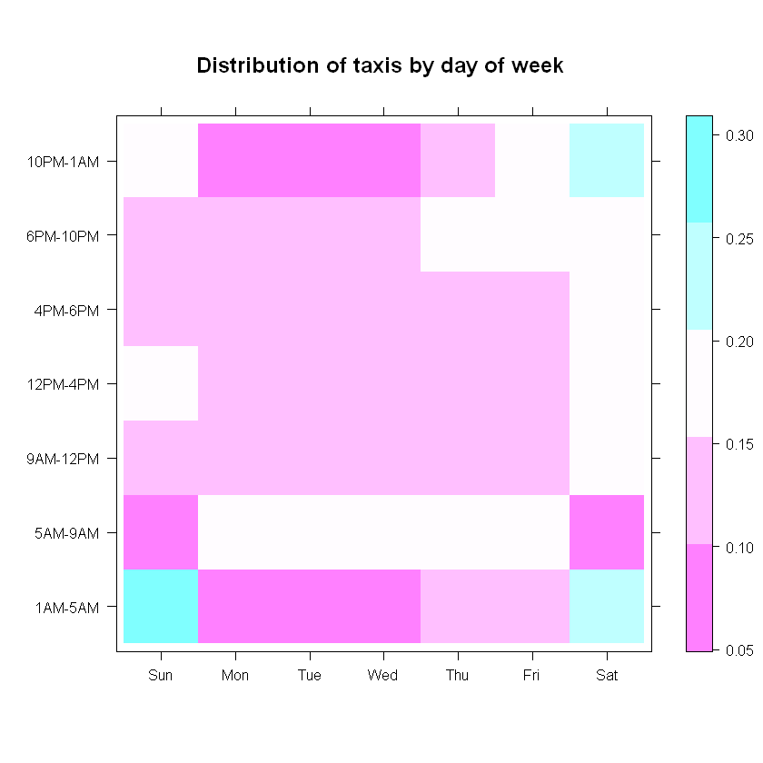
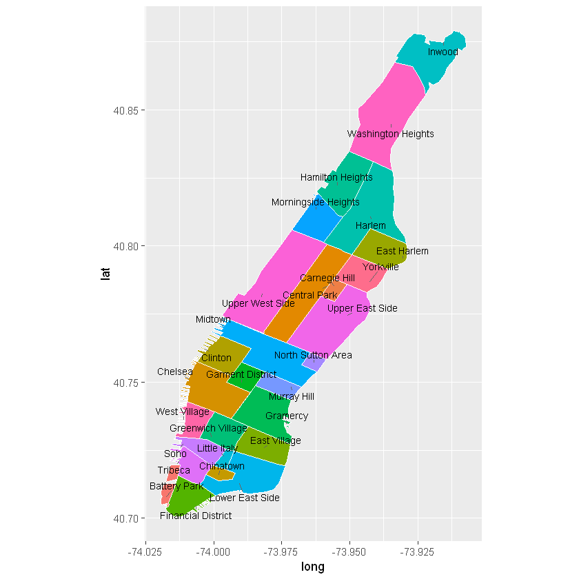

```{r setup, include=FALSE}
knitr::opts_chunk$set(echo = TRUE)
```


### Creating new features

Once data in brought in for analysis, we can begin thinking about the interesting/relevant features that go into the analysis.  Our goal is primarily exploratory: we want to tell a story based on the data.  In that sense, any piece of information contained in the data can be useful.  Additionally, new information (or features) can be extracted from existing data points.  It is not only important to think of which features to extract, but also what their column type must be, so that later analyses run appropriately.  As a first example, consider a simple transformation for extracting the percentage that passengers tipped for the trip.

This is where we encounter the `rxDataStep` function, a function that we will revisit many times. `rxDataStep` is an essential function in that it is the most important data transformation function in `RevoScaleR` (the others being `rxMerge` and `rxSort`); most other analytics functions are data summary and modeling functions.  `rxDataStep` can be used to

- modify existing columns or add new columns to the data
- keep or drop certain columns from the data before writing to a new file
- keep or drop certain rows of the data before writing to a new file

In a local compute context, when we run `rxDataStep`, we specify an `inData` argument which can point to a `data.frame` or a CSV or XDF file.  We also have an `outFile` argument that points to the file we are outputting to, and if both `inData` and `outFile` point to the same file, we must set `overwrite = TRUE`.  **Note that `outFile` is an optional argument: leaving it out will output the result into a `data.frame`.  However, in most cases that is not what we want, so we need to specify `outFile`.**


```{r 3.01}
rxDataStep(nyc_xdf, nyc_xdf, 
           transforms = list(tip_percent = as.integer(tip_amount*100 / (tip_amount + fare_amount))),
           overwrite = TRUE)
rxSummary( ~ tip_percent, nyc_xdf)
```

    Rows Processed: 38551116 
    Rows Processed: 38551116 
    


    Call:
    rxSummary(formula = ~tip_percent, data = nyc_xdf)
    
    Summary Statistics Results for: ~tip_percent
    Data: nyc_xdf (RxXdfData Data Source)
    File name: yellow_tripdata_2015.xdf
    Number of valid observations: 38551116 
     
     Name        Mean     StdDev   Min Max ValidObs MissingObs
     tip_percent 10.41051 9.248044 -3  118 38540843 10273     


In the last part `rxDataStep` was introduced to perform a simple one-liner transformation.  We now use `rxDataStep` again to perform some other, this time more complicated transformations.  We can sometimes perform these more complex transformations as longer one-liners using the `transforms` argument, following the above example.  But a cleaner way to do it is to create a function that contains the logic of our transformations and pass it to the `transformFunc` argument. This function takes the data as input and usually returns the same data as output with one or more columns added or modified. More specifically, the input to the transformation function is a `list` whose elements are the columns.  Otherwise, it is just like any R function. Using the `transformFunc` argument allows us to focus on writing a transformation function and quickly testing them on the sample `data.frame` before we run them on the whole data.

For the NYC Taxi data, we are interested in comparing trips based on day of week and the time of day.  Those two columns do not exist yet, but we can extract them from pickup datetime and dropoff datetime.  To extact the above features, we use the `lubridate` package, which has useful functions for dealing with date and time columns.  To perform these transformations, we use a transformation function called `f_datetime_transformations`.


```{r 3.02}
f_datetime_transformations <- function(data) { # transformation function for extracting some date and time features
  
  weekday_labels <- c('Sun', 'Mon', 'Tue', 'Wed', 'Thu', 'Fri', 'Sat')
  cut_levels <- c(1, 5, 9, 12, 16, 18, 22)
  hour_labels <- c('1AM-5AM', '5AM-9AM', '9AM-12PM', '12PM-4PM', '4PM-6PM', '6PM-10PM', '10PM-1AM')
  
  pickup_datetime <- ymd_hms(data$tpep_pickup_datetime, tz = "UTC")
  pickup_hour <- addNA(cut(hour(pickup_datetime), cut_levels))
  pickup_dow <- factor(wday(pickup_datetime), levels = 1:7, labels = weekday_labels)
  levels(pickup_hour) <- hour_labels
  
  dropoff_datetime <- ymd_hms(data$tpep_dropoff_datetime, tz = "UTC")
  dropoff_hour <- addNA(cut(hour(dropoff_datetime), cut_levels))
  dropoff_dow <- factor(wday(dropoff_datetime), levels = 1:7, labels = weekday_labels)
  levels(dropoff_hour) <- hour_labels
  
  data$pickup_hour <- pickup_hour
  data$pickup_dow <- pickup_dow
  data$dropoff_hour <- dropoff_hour
  data$dropoff_dow <- dropoff_dow
  data$trip_duration <- as.integer(as.duration(dropoff_datetime - pickup_datetime))
  
  data
}
```

Before we apply the transformation to the data, it's ususally a good idea to test it and make sure it's working.  We set aside a sample of the data as a `data.frame` for this purpose. Running the transformation function on `nyc_sample_df` should return the original data with the new columns.


```{r 3.03}
library(lubridate)
Sys.setenv(TZ = "US/Eastern") # not important for this dataset
head(f_datetime_transformations(nyc_sample_df)) # test the function on a data.frame
```


We run one last test before applying the transformation.  Recall that `rxDataStep` works with a `data.frame` input too, and that leaving the `outFile` argument means we return a `data.frame`.  So we can perform the above test with `rxDataStep` by passing transformation function to `transformFunc` and specifying the required packages in `transformPackages`.


```{r 3.04}
head(rxDataStep(nyc_sample_df, transformFunc = f_datetime_transformations, transformPackages = "lubridate"))
```

    Rows Processed: 1000 
    


Everything seems to be working well.  This does not guarantee that running the transformation function on the whole dataset will succeed, but it makes it less likely to fail for the wrong reasons.  If the transformation works on the sample `data.frame`, as it does above, but fails when we run it on the whole dataset, then it is usually because of something in the dataset that causes it to fail (such as missing values) that was not present in the sample data.  We now run the transformation on the whole data set.


```{r 3.05}
st <- Sys.time()
rxDataStep(nyc_xdf, nyc_xdf, overwrite = TRUE, transformFunc = f_datetime_transformations, transformPackages = "lubridate")
Sys.time() - st
```

    Rows Processed: 38551116 
    


    Time difference of 7.304844 mins


Let's examine the new columns we created to make sure the transformation more or less worked.  We use the `rxSummary` function to get some statistical summaries of the data.  The `rxSummary` function is akin to the `summary` function in base R (aside from the fact that `summary` only works on a `data.frame`) in two ways:

- It provides numerical summaries for numeric columns (except for percentiles, for which we use the `rxQuantile` function).
- It provides counts for each level of the factor columns.

We use the same *formula notatation* used by many other R modeling or plotting functions to specify which columns we want summaries for.  For example, here we want to see summaries for `pickup_hour` and `pickup_dow` (both factors) and `trip_duration` (numeric, in seconds).


```{r 3.06}
rxs1 <- rxSummary( ~ pickup_hour + pickup_dow + trip_duration, nyc_xdf)
# we can add a column for proportions next to the counts
rxs1$categorical <- lapply(rxs1$categorical, function(x) cbind(x, prop = round(prop.table(x$Counts), 2)))
rxs1
```

    Rows Processed: 38551116 
    


    Call:
    rxSummary(formula = ~pickup_hour + pickup_dow + trip_duration, 
        data = nyc_xdf)
    
    Summary Statistics Results for: ~pickup_hour + pickup_dow +
        trip_duration
    Data: nyc_xdf (RxXdfData Data Source)
    File name: yellow_tripdata_2015.xdf
    Number of valid observations: 38551116 
     
     Name          Mean     StdDev   Min     Max      ValidObs MissingObs
     trip_duration 881.3768 24640.81 -160568 32913338 38551116 0         
    
    Category Counts for pickup_hour
    Number of categories: 7
    Number of valid observations: 38551116
    Number of missing observations: 0
    
     pickup_hour Counts  prop
     1AM-5AM     2191112 0.06
     5AM-9AM     5815782 0.15
     9AM-12PM    5511568 0.14
     12PM-4PM    7402597 0.19
     4PM-6PM     4294455 0.11
     6PM-10PM    9009289 0.23
     10PM-1AM    4326313 0.11
    
    Category Counts for pickup_dow
    Number of categories: 7
    Number of valid observations: 38551116
    Number of missing observations: 0
    
     pickup_dow Counts  prop
     Sun        5344086 0.14
     Mon        4832234 0.13
     Tue        5129572 0.13
     Wed        5171841 0.13
     Thu        5748712 0.15
     Fri        6023898 0.16
     Sat        6300773 0.16


Separating two variables by a colon (`pickup_dow:pickup_hour`) instead of a plus sign (`pickup_dow + pickup_hour`) allows us to get summaries for each combination of the levels of the two factor columns, instead of individual ones.


```{r 3.07}
rxs2 <- rxSummary( ~ pickup_dow:pickup_hour, nyc_xdf)
rxs2 <- tidyr::spread(rxs2$categorical[[1]], key = 'pickup_hour', value = 'Counts')
row.names(rxs2) <- rxs2[ , 1]
rxs2 <- as.matrix(rxs2[ , -1])
print(rxs2)
```

    Rows Processed: 38551116 
        1AM-5AM 5AM-9AM 9AM-12PM 12PM-4PM 4PM-6PM 6PM-10PM 10PM-1AM
    Sun  642007  417383   812736  1147899  569992   924624   829445
    Mon  171310  909789   732184   980133  581008  1096015   361795
    Tue  142726  946797   732443   982840  606117  1318106   400543
    Wed  161107  983974   736242   958832  581711  1314073   435902
    Thu  254009 1015180   794871  1041152  623903  1428198   591399
    Fri  257212 1010338   818127  1064840  652733  1508977   711671
    Sat  562741  532321   884965  1226901  678991  1419296   995558
    

In the above case, the individual counts are not as helpful to us as proportions from those counts, and for comparing across different days of the week, we want the proportions to be based on totals for each column, not the entire table.  We ask for proportions based on column totals by passing the 2 to as second argument to the `prop.table` function. We can also visually display the proportions using the `levelplot` function.


```{r 3.08}
levelplot(prop.table(rxs2, 2), cuts = 4, xlab = "", ylab = "", main = "Distribution of taxis by day of week")
```





Interesting results manifest themselves in the above plot:

1. Early morning (between 5AM and 9AM) taxi rides are predictably at their lowest on weekends, and somewhat on Mondays (the Monday blues effect?).
2. During the business hours (between 9AM and 6PM), about the same proportion of taxi trips take place (about 42 to 45 percent) for each day of the week, including weekends.  In other words, regardless of what day of the week it is, a little less than half of all trips take place beween 9AM and 6PM.
3. We can see a spike in taxi rides between 6PM and 10PM on Thursday and Friday evenings, and a spike between 10PM and 1AM on Friday and especially Saturday evenings. Taxi trips between 1AM and 5AM spike up on Saturdays (the Friday late-night outings) and even more so on Sundays (the Saturday late-night outings).  They fall sharply on other days, but right slightly on Fridays (in anticipation!). In other words, more people go out on Thursdays but don't stay out late, even more people go out on Fridays and stay even later, but Saturday is the day most people choose for a really late outing.

### Adding neighborhoods

We now add another set of features to the data: pickup and dropoff neighborhoods.  Getting neighborhood information from longitude and latitude is not something we can hardcode easily, so instead we rely a few GIS packages and a **shapefile** (coutesy of Zillow [http://www.zillow.com/howto/api/neighborhood-boundaries.htm]).  A shapefile is a file that contains geographical information inside of it, including information about boundaries separating geographical areas.  The `ZillowNeighborhoods-NY.shp` file has information about NYC neighborhoods.  After reading in the shapefile and setting the coordinates of the NYC taxi data, we can use the function `over` (part of the `sp` package) to find out pickup and dropoff neighborhoods.  We will not cover the specifics of working with shapefiles, and refer the user to the `maptools` package for documentation.


```{r 3.09}
library(rgeos)
library(sp)
library(maptools)

nyc_shapefile <- readShapePoly('ZillowNeighborhoods-NY/ZillowNeighborhoods-NY.shp')
mht_shapefile <- subset(nyc_shapefile, str_detect(CITY, 'New York City-Manhattan'))

mht_shapefile@data$id <- as.character(mht_shapefile@data$NAME)
mht.points <- fortify(gBuffer(mht_shapefile, byid = TRUE, width = 0), region = "NAME")
mht.df <- inner_join(mht.points, mht_shapefile@data, by = "id")

library(dplyr)
mht.cent <- mht.df %>%
  group_by(id) %>%
  summarize(long = median(long), lat = median(lat))

library(ggrepel)
ggplot(mht.df, aes(long, lat, fill = id)) + 
  geom_polygon() +
  geom_path(color = "white") +
  coord_equal() +
  theme(legend.position = "none") +
  geom_text_repel(aes(label = id), data = mht.cent, size = 3)
```





```{r 3.10}
find_nhoods <- function(data) {
  # data <- as.data.frame(data)
  
  pickup_longitude <- ifelse(is.na(data$pickup_longitude), 0, data$pickup_longitude)
  pickup_latitude <- ifelse(is.na(data$pickup_latitude), 0, data$pickup_latitude)
  dropoff_longitude <- ifelse(is.na(data$dropoff_longitude), 0, data$dropoff_longitude)
  dropoff_latitude <- ifelse(is.na(data$dropoff_latitude), 0, data$dropoff_latitude)
  
  data_coords <- data.frame(long = pickup_longitude, lat = pickup_latitude)
  coordinates(data_coords) <- c('long', 'lat')
  nhoods <- over(data_coords, shapefile)
  data$pickup_nhood <- nhoods$NAME
  data$pickup_borough <- nhoods$CITY
  
  data_coords <- data.frame(long = dropoff_longitude, lat = dropoff_latitude)
  coordinates(data_coords) <- c('long', 'lat')
  nhoods <- over(data_coords, shapefile)
  data$dropoff_nhood <- nhoods$NAME
  data$dropoff_borough <- nhoods$CITY
  
  data
}
```

Once again, it is a good idea to try the transformation function on the sample `data.frame` to catch any errors before deploying it to the whole data. Sometimes errors messages we get are more informative when we apply the transformation to a `data.frame`, and it's easier to trace it back and debug it.  So here we use `rxDataStep` and feed it `nyc_sample_df` (with no `outFile` argument) to see what the data looks like after applying the transformation function `find_nhoods` to it.


```{r 3.11}
# test the function on a data.frame using rxDataStep
head(rxDataStep(nyc_sample_df, transformFunc = find_nhoods, transformPackages = c("sp", "maptools"), 
                transformObjects = list(shapefile = nyc_shapefile)))
```

    Rows Processed: 1000 
    


#### ELDERSVELD - see if we can avoid this as it takes too long...
Since everything went well, we can now apply the transformation to the whole data and reasonably expect that it should work.


```{r 3.12}
st <- Sys.time()
rxDataStep(nyc_xdf, nyc_xdf, overwrite = TRUE, transformFunc = find_nhoods, transformPackages = c("sp", "maptools", "rgeos"), 
           transformObjects = list(shapefile = nyc_shapefile))

Sys.time() - st
head(nyc_xdf)
```

    Rows Processed: 38551116 
    


    Time difference of 16.47321 mins


By passing `~ .` as the formula to `rxSummary`, we can summarize all the columns in the data.


```{r 3.13}
system.time(
rxs_all <- rxSummary( ~ ., nyc_xdf)
)
```

    Rows Processed: 38551116 
    


       user  system elapsed 
       0.05    0.00   49.10 


```{r 3.14}
nhoods_by_borough <- rxCrossTabs( ~ pickup_nhood:pickup_borough, nyc_xdf)
nhoods_by_borough <- nhoods_by_borough$counts[[1]]
nhoods_by_borough <- as.data.frame(nhoods_by_borough)

# get the neighborhoods by borough
lnbs <- lapply(names(nhoods_by_borough), function(vv) subset(nhoods_by_borough, nhoods_by_borough[ , vv] > 0, select = vv, drop = FALSE))
print(lnbs)
```

    Rows Processed: 38551116 
    [[1]]
                    Albany
    Sheridan Hollow      1
    
    [[2]]
    [1] Buffalo
    <0 rows> (or 0-length row.names)
    
    [[3]]
                             New York City-Bronx
    Baychester                                86
    Bedford Park                             854
    City Island                               19
    Country Club                             283
    Eastchester                              113
    Fordham                                  829
    High Bridge                             4196
    Hunts Point                              442
    Kings Bridge                            1061
    Morris Heights                          1200
    Morris Park                              564
    Mott Haven                             13535
    Parkchester                             1254
    Riverdale                                465
    Soundview                                876
    South Bronx                             4572
    Spuyten Duyvil                           257
    Throggs Neck                             308
    Tremont                                 1060
    Union Port                               618
    University Heights                       981
    Wakefield-Williamsbridge                 433
    Williams Bridge                          296
    Woodlawn-Nordwood                        250
    
    [[4]]
                             New York City-Brooklyn
    Bay Ridge                                  2091
    Bedford-Stuyvesant                        32747
    Bensonhurst                                 983
    Boerum Hill                               43572
    Borough Park                               5284
    Brownsville                                1001
    Bushwick                                  17030
    Canarsie                                    863
    Carroll Gardens                           56625
    Cobble Hill                               20747
    Downtown                                  73207
    Dyker Heights                               361
    East Brooklyn                              1302
    Flatbush                                     37
    Fort Green                               101158
    Gravesend-Sheepshead Bay                   1697
    Greenwood                                  5210
    Mapleton-Flatlands                         4270
    Park Slope                                39195
    Red Hook                                      1
    Sunset Park                                2404
    Williamsburg                             158450
    
    [[5]]
                        New York City-Manhattan
    Battery Park                         314825
    Carnegie Hill                        433527
    Central Park                         482725
    Chelsea                             2589464
    Chinatown                            121779
    Clinton                             1190227
    East Harlem                          122702
    East Village                        1386383
    Financial District                   768536
    Garment District                    2150281
    Gramercy                            3060037
    Greenwich Village                   1784939
    Hamilton Heights                      77796
    Harlem                               198367
    Inwood                                 3758
    Little Italy                         334124
    Lower East Side                      892285
    Midtown                             6257136
    Morningside Heights                  199645
    Murray Hill                         1281773
    North Sutton Area                    397204
    Soho                                 791565
    Tribeca                              634100
    Upper East Side                     5132330
    Upper West Side                     3141363
    Washington Heights                    49661
    West Village                         905412
    Yorkville                            250824
    
    [[6]]
                             New York City-Queens
    Astoria-Long Island City               190528
    Auburndale                                279
    Clearview                                  64
    Corona                                   1158
    Douglastown-Little Neck                   717
    Flushing                                 4018
    Forest Hills                            11586
    Glendale                                  638
    Jackson Heights                         37244
    Jamaica                                  7929
    Laurelton                                 231
    Maspeth                                  3080
    Middle Village                            857
    Nkew Gardens                             4961
    Queens Village                            270
    Queensboro Hill                           468
    Ridgewood                                2204
    Saintalbans                               199
    Springfield Gardens                       913
    Steinway                                   54
    Sunny Side                             127508
    The Rockaways                             337
    Utopia                                   3891
    Woodhaven-Richmond Hill                  1915
    Woodside                                32671
    
    [[7]]
                                New York City-Staten Island
    Annandale                                             2
    Ardon Heights                                         6
    Bloomfield-Chelsea-Travis                            17
    Charlestown-Richmond Valley                           3
    Clifton                                              38
    Ettingville                                           6
    Great Kills                                           5
    Howland Hook                                         14
    Huguenot                                              3
    Mariners Harbor                                      31
    Midland Beach                                        49
    New Brighton                                        106
    Oakwood                                              30
    Port Richmond                                        25
    Prince's Bay                                          4
    Richmondtown                                         34
    Rosebank                                              3
    Rossville                                             5
    South Beach                                          56
    Todt Hill                                            29
    Tottensville                                          4
    Westerleigh-Castleton                                37
    
    [[8]]
    [1] Rochester
    <0 rows> (or 0-length row.names)
    
    [[9]]
    [1] Syracuse
    <0 rows> (or 0-length row.names)
    
    

Since the lion's share of taxi trips take place in Manhattan, we focus our attention to Manhattan only and ignore the other four boroughs.  For that purpose, we create two new columns called `pickup_nb` and `dropoff_nb` based on the original columns `pickup_nhood` and `dropoff_nhood` except that their factor levels are limited to Manhattan neighborhoods (any other factor level will be replaced with an NA).  It is important to do so, because otherwise neighborhoods outside of Manhattan will show up in any modeling or summary function involving those columns.


```{r 3.15}
manhattan_nhoods <- rownames(nhoods_by_borough)[nhoods_by_borough$`New York City-Manhattan` > 0]

refactor_columns <- function(dataList) {
  dataList$pickup_nb = factor(dataList$pickup_nhood, levels = nhoods_levels)
  dataList$dropoff_nb = factor(dataList$dropoff_nhood, levels = nhoods_levels)
  dataList
}

rxDataStep(nyc_xdf, nyc_xdf, 
           transformFunc = refactor_columns,
           transformObjects = list(nhoods_levels = manhattan_nhoods),
           overwrite = TRUE)

rxSummary( ~ pickup_nb, nyc_xdf)
```

    Rows Processed: 38551116 
    Rows Processed: 38551116 
    


    Call:
    rxSummary(formula = ~pickup_nb, data = nyc_xdf)
    
    Summary Statistics Results for: ~pickup_nb
    Data: nyc_xdf (RxXdfData Data Source)
    File name: yellow_tripdata_2015.xdf
    Number of valid observations: 38551116 
     
    
    Category Counts for pickup_nb
    Number of categories: 28
    Number of valid observations: 34952768
    Number of missing observations: 3598348
    
     pickup_nb           Counts 
     Battery Park         314825
     Carnegie Hill        433527
     Central Park         482725
     Chelsea             2589464
     Chinatown            121779
     Clinton             1190227
     East Harlem          122702
     East Village        1386383
     Financial District   768536
     Garment District    2150281
     Gramercy            3060037
     Greenwich Village   1784939
     Hamilton Heights      77796
     Harlem               198367
     Inwood                 3758
     Little Italy         334124
     Lower East Side      892285
     Midtown             6257136
     Morningside Heights  199645
     Murray Hill         1281773
     North Sutton Area    397204
     Soho                 791565
     Tribeca              634100
     Upper East Side     5132330
     Upper West Side     3141363
     Washington Heights    49661
     West Village         905412
     Yorkville            250824