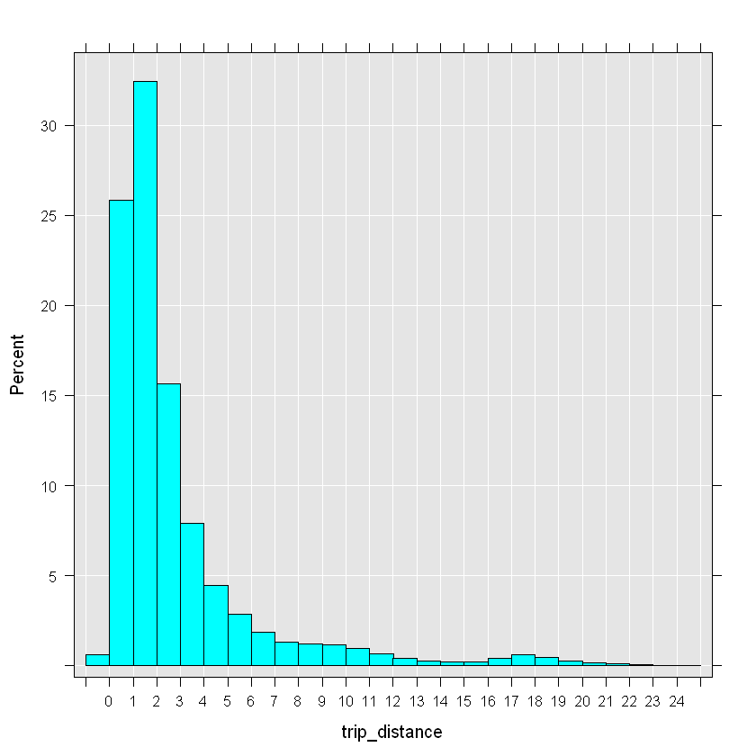
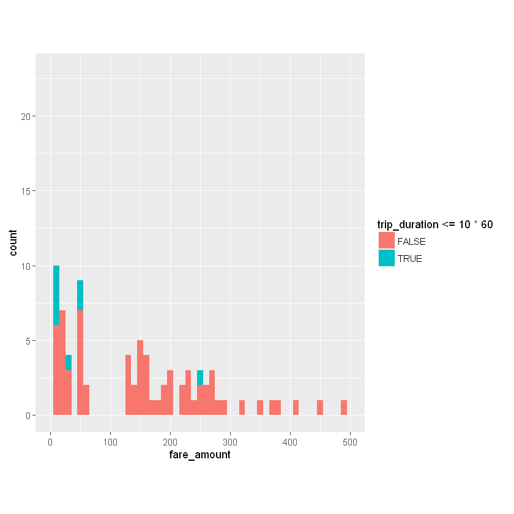

```{r setup, include=FALSE}
knitr::opts_chunk$set(echo = TRUE)
knitr::opts_knit$set(root.dir = "C:/Data/NYC_taxi")
```

### Cleaning the data

Data is messy and often needs to be cleaned before we can do much with it.  Looking at the previous summaries and snapshots of the data, we can often tell how the data needs to be cleaned.  Here are some suggestions:

- *Have missing values been properly accounted for?* In flat files missing values have often a different representation as NAs. For example, missing values for character columns can have an empty entry or one with a catchall term such as 'other' or 'n/a', while missing numeric columns can have empty cells, or use NULL or 999. Sometimes, different codes are used to delineate different kinds of missing values (such as data missing because the information is not relevant, or missing because the information was not provided).  When recoding missing values to NAs in R, it's important to account for such differences.
- *Do column types match our expectation?* This is an important consideration, and we dealt with it by explicitly providing column types prior to reading the data.  This is the preferred approach since it avoids unnecessary processing, especially the processing that takes place when R reads in a column as a `factor` when it's not needed.  Columns with high cardinality that are formatted as `factor` add a lot of overhead to R session.  Such columns often don't need to be `factor` and should remain as `integer` or `character` columns.  If we don't know ahead of time which columns should be factors and which not, or if we need to clean a column before turning it into a `factor`, then we can suppress the automatic conversion of `character` columns to `factor` columns by setting `stringsAsFactors = FALSE` when we run `rxImport` or specifying all non-numeric columns to be `character` columns.
- *Are there outliers in the data and do they seem legitimate?* Often, the question of what an outlier is depends on our understanding of the data and tolerance for deviations from the average patterns in the data.  In the NYC Taxi dataset, consider the following cases: (1) A passenger might take a cab and use it all day for running multiple errands, asking the driver to wait for him.  (2) A passenger might intend to tip 5 dollars and accidentally press 5 twice and tip 55 dollars for a trip that cost 40 dollars.  (3) A passenger could get into a argument with a driver and leave without paying.  (4) Multi-passenger trips could have one person pay for everyone or each person pay for himself, with some paying with a card and others using cash. (5) A driver can accidentally keep the meter running after dropping someone off.  (6) Machine logging errors can result in either no data or wrong data points.  In all of these cases, even assuming that we can easily capture the behavior (because some combination of data points falls within unusual ranges) whether or not we consider them *legitimate* still depends on what the purpose of our analysis is.  An outlier could be noise to one analysis and a point of interest to another.

Now that we have the data with candidate outliers, we can examine it for certain patterns.  For example, we can plot a histogram of `trip_distance` and notice that almost all trips traveled a distance of less than 20 miles, with the great majority going less than 5 miles.


```{r 4.01}
rxHistogram( ~ trip_distance, nyc_xdf, startVal = 0, endVal = 25, histType = "Percent", numBreaks = 20)
```



There is a second peak around around trips that traveled between 16 and 20, which is worth examining further.  We can verify this by looking at which neighborhoods passengers are traveling from and to.


```{r 4.02}
rxs <- rxSummary( ~ pickup_nhood:dropoff_nhood, nyc_xdf, rowSelection = (trip_distance > 15 & trip_distance < 22))
head(arrange(rxs$categorical[[1]], desc(Counts)), 10)
```


As we can see, `Gravesend-Sheepshead Bay` often appears as a destination, and surprisingly, not as a pickup point.  We can also see trips from and to `Jamaica`, which is the neighborhood closest to the JFK airport. 

### Examining outliers

Let's see how we could use `RevoScaleR` to examine the data for outliers.  Our approach here is rather premitive, but the intent is to show how the use the tools:  We use `rxDataStep` and its `rowSelection` argument to extract all the data points that are candidate outliers.  By leaving the `outFile` argument we output the resulting dataset into a `data.frame` which we call `odd_trips`.  Lastly, if we are too expansive in our outlier selection criteria, then resulting `data.frame` could still have too many rows (which could clog the memory and make it slow to produce plots and other summaries).  So we create a new column `u` and populate it with random uniform numbers between 0 and 1, and we add `u < .05` to our `rowSelection` criteria.  We can adjust this number to end up with a smaller `data.frame` (threshold closer to 0) or a larger `data.frame` (threshold closer to 1).


```{r 4.03}
# outFile argument missing means we output to data.frame
odd_trips <- rxDataStep(nyc_xdf, rowSelection = (
  u < .05 & ( # we can adjust this if the data gets too big
    (trip_distance > 50 | trip_distance <= 0) |
    (passenger_count > 5 | passenger_count == 0) |
    (fare_amount > 5000 | fare_amount <= 0)
)), transforms = list(u = runif(.rxNumRows)))

print(dim(odd_trips))
```


Since the dataset with the candidate outliers is a `data.frame`, we can use any R function to examine it.  For example, we limit `odd_trips` to cases where a distance of more than 50 miles was traveled, plot a histogram of the fare amount the passenger paid, and color it based on wether the trip took more or less than 10 minutes.


```{r 4.04}
odd_trips %>% 
  filter(trip_distance > 50) %>%
  ggplot() -> p

p + geom_histogram(aes(x = fare_amount, fill = trip_duration <= 10*60), binwidth = 10) +
  xlim(0, 500) + coord_fixed(ratio = 25)
```





As we can see, the majority of trips that traveled over 50 miles cost nothing or next to nothing, even though most of these trips took 10 minutes or longer.  It is unclear whether such trips were the result of machine error human error, but if for example this analysis was targeted at the company that owns the taxis, this finding would warrant more investigation.

## Limiting data to Manhattan

We now narrow our field of vision by focusing on trips that took place inside of Manhattan only, and meet "reasonable" criteria for a trip.  Since we added new features to the data, we can also drop some old columns from the data so that the data can be processed faster.


```{r 4.05}
input_xdf <- 'yellow_tripdata_2015_manhattan.xdf'
mht_xdf <- RxXdfData(input_xdf)
```


```{r 4.06}
rxDataStep(nyc_xdf, mht_xdf, 
           rowSelection = (
             passenger_count > 0 &
               trip_distance >= 0 & trip_distance < 30 &
               trip_duration > 0 & trip_duration < 60*60*24 &
               str_detect(pickup_borough, 'Manhattan') &
               str_detect(dropoff_borough, 'Manhattan') &
               !is.na(pickup_nb) &
               !is.na(dropoff_nb) &
               fare_amount > 0), 
           transformPackages = "stringr",
           varsToDrop = c('extra', 'mta_tax', 'improvement_surcharge', 'total_amount', 
                          'pickup_borough', 'dropoff_borough', 'pickup_nhood', 'dropoff_nhood'),
           overwrite = TRUE)
```

And since we limited the scope of the data, it might be a good idea to create a sample of the new data (as a `data.frame`).  Our last sample, `nyc_sample_df` was not a good sample, since we only took the top 1000 rows of the data.  This time, we use `rxDataStep` to create a random sample of the data, containing only 1 percent of the rows from the larger dataset.


```{r 4.07}
mht_sample_df <- rxDataStep(mht_xdf, rowSelection = (u < .01), 
                            transforms = list(u = runif(.rxNumRows)))

dim(mht_sample_df)
```


We could use **k-means clustering** to cluster the data based on longitude and latitude, which we would have to rescale so they have the same influence on the clusters (a simple way to rescale them is to divide longitude by -74 and latitude by 40).  Once we have the clusters, we can plot the cluster **centroids** on the map instead of the individual data points that comprise each cluster.


```{r 4.08}
start_time <- Sys.time()
rxkm_sample <- kmeans(transmute(mht_sample_df, long_std = dropoff_longitude / -74, lat_std = dropoff_latitude / 40), centers = 300, iter.max = 2000)
Sys.time() - start_time

# we need to put the centroids back into the original scale for coordinates
centroids_sample <- rxkm_sample$centers %>%
  as.data.frame %>%
  transmute(long = long_std*(-74), lat = lat_std*40, size = rxkm_sample$size)

head(centroids_sample)
```