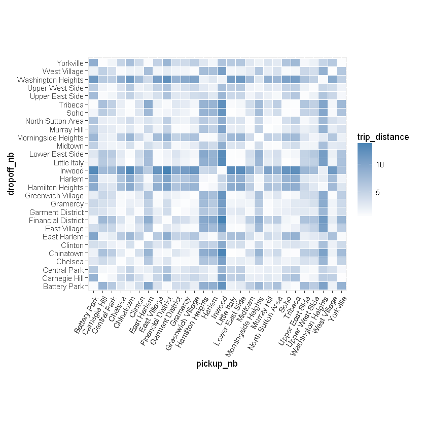
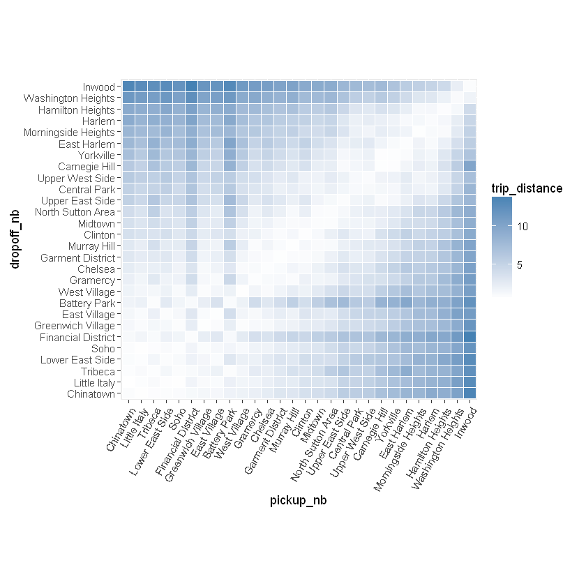
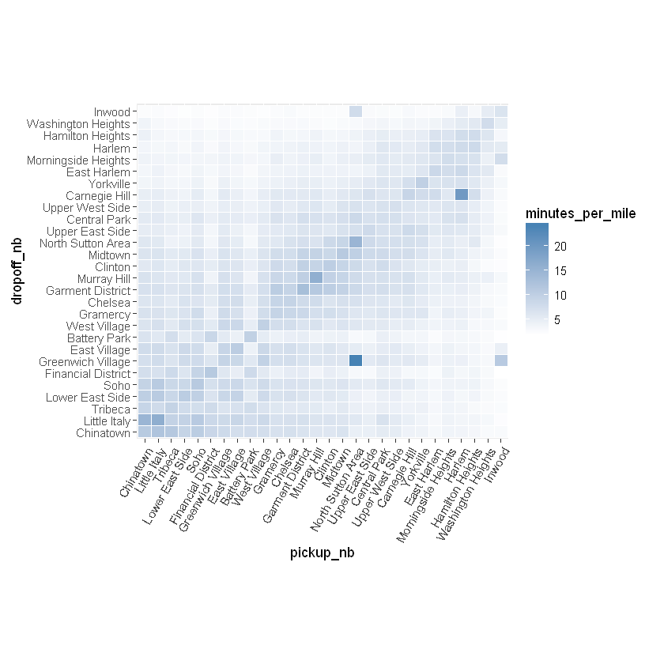
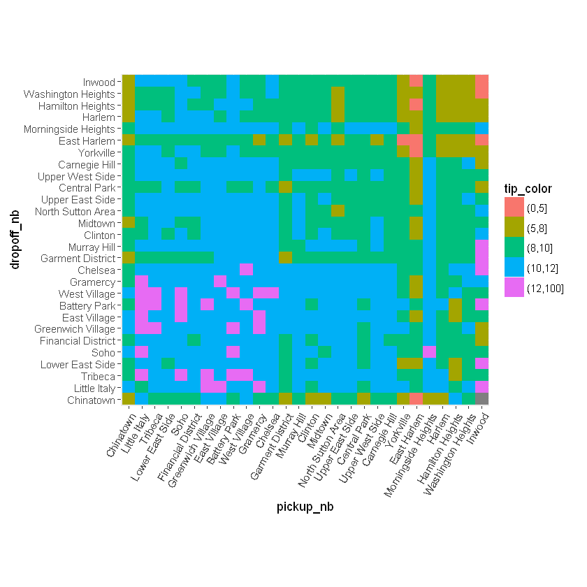
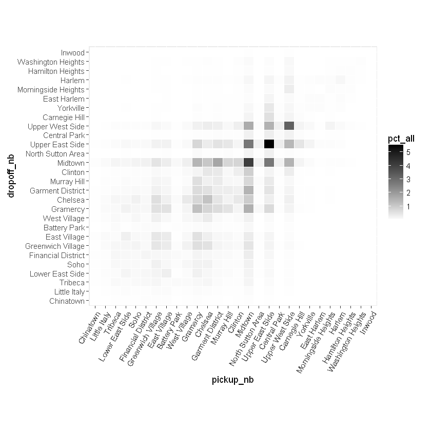
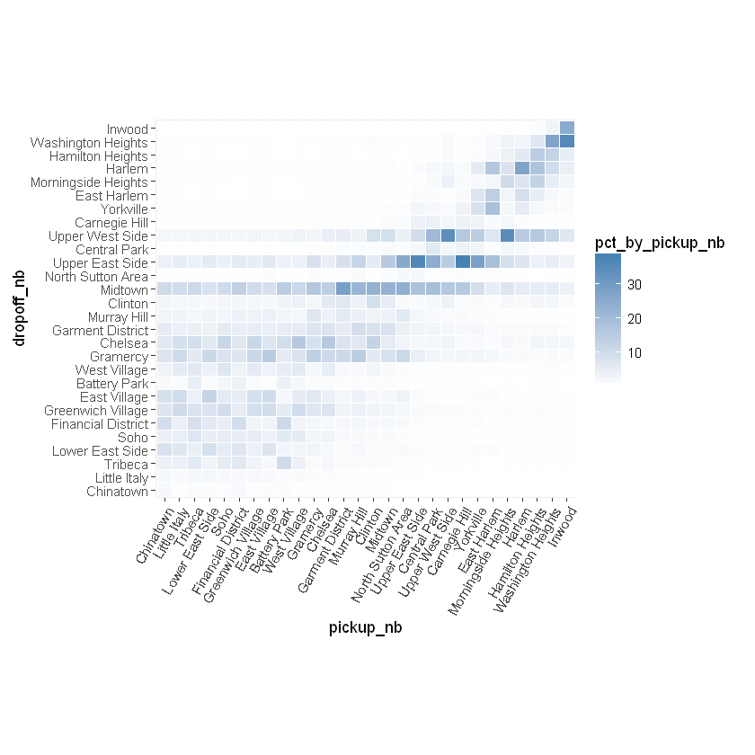
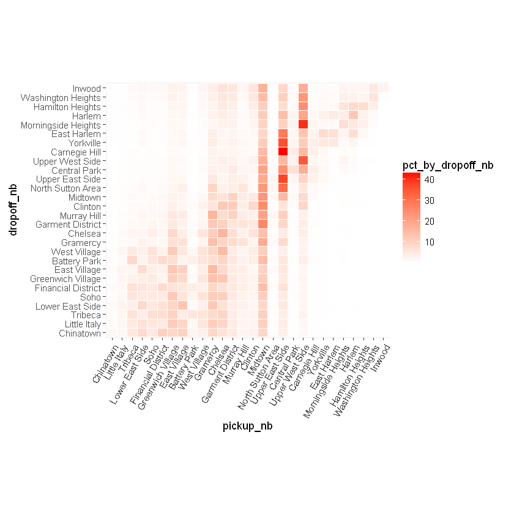
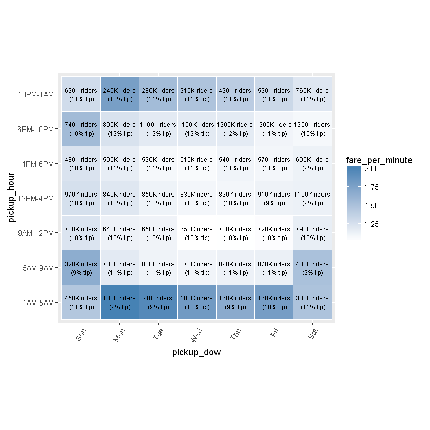

```{r setup, include=FALSE}
knitr::opts_chunk$set(echo = TRUE)
knitr::opts_knit$set(root.dir = "C:/Data/NYC_taxi")
```

## Spatial patterns

As our next task, we seek to find patterns between pickup and dropoff neighborhoods and other variables such as fare amount, trip distance, traffic and tipping.

### Distances and traffic

Trip distance is shown in the data.  To estimate traffic by looking at the ratio of trip duration and trip distance, assuming that traffic is the most common reason for trips taking longer than they should.

For this analysis, we use the `rxCube` and `rxCrossTabs` are both very similar to `rxSummary` but they return fewer statistical summaries and therefore run faster.  With `y ~ u:v` as the formula, `rxCrossTabs` returns counts and sums, and `rxCube` returns counts and averages for column `y` broken up by any combinations of columns `u` and `v`.  Another important difference between the two functions is that `rxCrossTabs` returns an array but `rxCube` returns a `data.frame`.  Depending on the application in question, we may prefer one to the other (and of course we can always convert one form to the other by "reshaping" it, but doing so would involve extra work).

Let's see what this means in action: We start by using `rxCrossTabs` to get sums and counts for `trip_distance`, broken up by `pickup_nb` and `dropoff_nb`.  We can immediately divide the sums by the counts to get averages.  The result is called a **distance matirx** and can be fed to the `seriate` function in the `seriation` library to order it so closer neighborhoods appear next to each other (right now neighborhoods are sorted alphabetically, which is what R does by default with factor levels unless otherwise specified).


```{r 5.01}
rxct <- rxCrossTabs(trip_distance ~ pickup_nb:dropoff_nb, mht_xdf)
res <- rxct$sums$trip_distance / rxct$counts$trip_distance

library(seriation)
res[which(is.nan(res))] <- mean(res, na.rm = TRUE)
nb_order <- seriate(res)
```

We will use `nb_order` in a little while, but before we do so, let's use `rxCube` to get counts and averages for `trip_distance`, a new data point representing minutes spent in the taxi per mile of the trip, and `tip_percent`.  In the above example, we used `rxCrossTabs` because we wanted a matrix as the return object, so we could feed it to `seriate`.  We now use `rxCube` to get a `data.frame` instead, since we intend to use it for plotting with `ggplot2`, which is more easier to code using a long `data.frame` as input compared to a wide `matirx`.


```{r 5.02}
rxc1 <- rxCube(trip_distance ~ pickup_nb:dropoff_nb, mht_xdf)
rxc2 <- rxCube(minutes_per_mile ~ pickup_nb:dropoff_nb, mht_xdf, 
               transforms = list(minutes_per_mile = (trip_duration/60)/trip_distance))
rxc3 <- rxCube(tip_percent ~ pickup_nb:dropoff_nb, mht_xdf)
res <- bind_cols(list(rxc1, rxc2, rxc3))
res <- res[ , c('pickup_nb', 'dropoff_nb', 'trip_distance', 'minutes_per_mile', 'tip_percent')]
head(res)
```

We can start plotting the above results to see some interesting trends.

```{r 5.03}
library(ggplot2)
ggplot(res, aes(pickup_nb, dropoff_nb)) + 
  geom_tile(aes(fill = trip_distance), colour = "white") + 
  theme(axis.text.x = element_text(angle = 60, hjust = 1)) +
  scale_fill_gradient(low = "white", high = "steelblue") + 
  coord_fixed(ratio = .9)
```





The problem with the above plot is the order of the neighborhoods (which is alphabetical), which makes the plot somewhat arbitrary and useless.  But as we saw above, using the `seriate` function we found a more natural ordering for the neighborhoods, so we can use it to reorder the above plot in a more suitable way.  To reorder the plot, all we need to do is reorder the factor levels in the order given by `nb_order`.


```{r 5.04}
newlevs <- levels(res$pickup_nb)[unlist(nb_order)]
res$pickup_nb <- factor(res$pickup_nb, levels = unique(newlevs))
res$dropoff_nb <- factor(res$dropoff_nb, levels = unique(newlevs))

library(ggplot2)
ggplot(res, aes(pickup_nb, dropoff_nb)) + 
  geom_tile(aes(fill = trip_distance), colour = "white") + 
  theme(axis.text.x = element_text(angle = 60, hjust = 1)) +
  scale_fill_gradient(low = "white", high = "steelblue") + 
  coord_fixed(ratio = .9)
```





Since trip distances remain fix, but trip duration mostly is a function of how much traffic there is, we can plot a look at the same plot as the above, but for the `minutes_per_mile` column, which will give us an idea of which neigborhoods have the most traffic between them.


```{r 5.05}
ggplot(res, aes(pickup_nb, dropoff_nb)) + 
  geom_tile(aes(fill = minutes_per_mile), colour = "white") + 
  theme(axis.text.x = element_text(angle = 60, hjust = 1)) + 
  scale_fill_gradient(low = "white", high = "steelblue") + 
  coord_fixed(ratio = .9)
```





As the plot shows, a lot of traffic happens between neighborhoods that are close to each other.  This is not very surprising since trips between neighborhoods that are far apart can be made using periphery routes that bypass most of the traffic through the town center.  We can also see generally high traffic in the midtown neighborhoods, and downtown especially between Chinatown and Little Italy.

We changed the order of the factor levels for `pickup_nb` and `dropoff_nb` to draw the above plots. However, this change best belongs in the data itself, otherwise every time we plot something involving `pickup_nb` or `dropoff_nb` we will need to change the order of the factor levels. So let's take the change and apply it to the whole data. We have two options for making the change:

  1. We can use `rxDataStep` with the `transforms` argument, and use the `base` R function `factor` to reorder the factor levels.
  2. We can use the `rxFactor` function and its `factorInfo` to manipulate the factors levels. The advantage of `rxFactors` is that it is faster, because it works at the metadata level. The disadvantage is that it may not work in other compute contexts such as Hadoop or Spark.
  
Both ways of doing this are shown here.


```{r 5.06}
# first way of reordering the factor levels
rxDataStep(inData = mht_xdf, outFile = mht_xdf,
           transforms = list(pickup_nb = factor(pickup_nb, levels = newlevs),
                             dropoff_nb = factor(dropoff_nb, levels = newlevs)),
           transformObjects = list(newlevels = unique(newlevs)),
           overwrite = TRUE)
```

```{r 5.07}
# second way of reordering the factor levels
rxFactors(mht_xdf, outFile = mht_xdf, factorInfo = list(pickup_nb = list(newLevels = unique(newlevs)), 
                                                        dropoff_nb = list(newLevels = unique(newlevs))),
         overwrite = TRUE)
```


### Fare amount and tipping behavior

Another interesting question to consider is the relationship between the fare amount and how much passengers tip in relation to which neighborhoods they travel between.  We create another plot similar to the ones above, showing fare amount on a grey background color scale, and displaying how much passengers tipped on average for the trip.  To make it easier to visually see patterns in tipping behavior, we color-code the average tip based on whether it's over 12%, less than 12%, less than 10%, less than 8%, and less than 5%.


```{r 5.08}
res %>%
  mutate(tip_color = cut(tip_percent, c(0, 5, 8, 10, 12, 100))) %>%
  ggplot(aes(pickup_nb, dropoff_nb)) + 
  geom_tile(aes(fill = tip_color)) + 
  theme(axis.text.x = element_text(angle = 60, hjust = 1)) + 
  coord_fixed(ratio = .9)
```





Some interesting results stand out:

- Trips leaving Battery Park or the Financial District going to midtown or uptown neighborhoods seem to cost a little more than seems warranted, and same trips leaving Greenwich Village going to Chinatown.
- Trips into and out of Chinatown tip consistently low (below 10%), especially if traveling to or coming from midtown and uptown neighborhoods.
- The most generous tippers (around 12%) are the ones traveling between downtown neighborhoods (except for Chinatown).  The next most generous tippers (around 11%) are the ones traveling between midtown neighborhoods and downtown neighborhoods in either direction.  The worst tippers are the one traveling between uptown neighborhoods.

### Overall and marginal distribution of trips

Let's focus our attention now to two other important questions:
- Between which neighborhoods do the most common trips occur?  
- Assuming that a traveler leaves out of a given neighborhood, which neighborhoods are they likely to go to?
- Assuming that someone was just dropped off at a given neighborhood, which neighborhoods are they most likely to have come from?

To answer the above questions, we need to find the distribution (or proportion) of trips between any pair of neighborhoods, first as a percentage of total trips, then as a percentage of trips *leaving out of* a particular neighborhood, and finally as a percentage of trips *going to* a particular neighborhood.


```{r 5.09}
rxc <- rxSummary(trip_distance ~ pickup_nb:dropoff_nb, mht_xdf)
rxc <- rxc$categorical[[1]][ , -1]

library(dplyr)
rxc %>% 
  filter(ValidObs > 0) %>%
  mutate(pct_all = ValidObs/sum(ValidObs) * 100) %>%
  group_by(pickup_nb) %>%
  mutate(pct_by_pickup_nb = ValidObs/sum(ValidObs) * 100) %>%
  group_by(dropoff_nb) %>%
  mutate(pct_by_dropoff_nb = ValidObs/sum(ValidObs) * 100) %>%
  group_by() %>%
  arrange(desc(ValidObs)) -> rxcs

head(rxcs)
```

Based on the first row, we can see that trips from the Upper East Side to the Upper East Side make up about 5% of all trips in Manhattan.  Of all the trips that pick up in the Upper East Side, about 36% drop off in the Upper East Side.  Of all the trips that drop off in the Upper East Side, 37% and tripped that also picked up in the Upper East Side.

We can take the above numbers and display them in plots that make it easier to digest it all at once.  We begin with a plot showing how taxi trips between any pair of neighborhoods are distributed.


```{r 5.10}
ggplot(rxcs, aes(pickup_nb, dropoff_nb)) + 
  geom_tile(aes(fill = pct_all), colour = "white") + 
  theme(axis.text.x = element_text(angle = 60, hjust = 1)) +
  scale_fill_gradient(low = "white", high = "black") + 
  coord_fixed(ratio = .9)
```




The plot shows that trips to and from the Upper East Side make up the majority of trips, a somewhat unexpected result.  Furthermore, the lion's share of trips are to and from the Upper East Side and the Upper West Side and the midtown neighborhoods (with most of this category having Midtown either as an origin or a destination).  Another surprising fact about the above plot is its near symmetry, which suggests that perhaps most passengers use taxis for a "round trip", meaning that they take a taxi to their destination, and another taxi for the return trip.  This point warrants further inquiry (perhaps by involving the time of day into the analysis) but for now we leave it at that.

Next we look at how trips leaving a particular neighborhood (a point on the x-axis in the plot below), "spill out" into other neighborhoods (shown by the vertical color gradient along the y-axis at each point on the x-axis).


```{r 5.11}
ggplot(rxcs, aes(pickup_nb, dropoff_nb)) + 
  geom_tile(aes(fill = pct_by_pickup_nb), colour = "white") + 
  theme(axis.text.x = element_text(angle = 60, hjust = 1)) +
  scale_fill_gradient(low = "white", high = "steelblue") + 
  coord_fixed(ratio = .9)
```





We can see how most downtown trips are to other downtown neighborhoods or to midtown neighborhoods (especially Midtown).  Midtown and the Upper East Side are common destinations from any neighborhood, and the Upper West Side is a common destination for most uptown neighborhoods.

For a trip ending at a particular neighborhood (represented by a point on the y-axis) we now look at the distribution of where the trip originated from (the horizontal color-gradient along the x-axis for each point on the y-axis).


```{r 5.12}
ggplot(rxcs, aes(pickup_nb, dropoff_nb)) + 
  geom_tile(aes(fill = pct_by_dropoff_nb), colour = "white") + 
  theme(axis.text.x = element_text(angle = 60, hjust = 1)) +
  scale_fill_gradient(low = "white", high = "red") + 
  coord_fixed(ratio = .9)
```





As we can see, a lot of trips claim Midtown regardless of where they ended.  The Upper East Side and Upper West Side are also common origins for trips that drop off in one of the uptown neighborhoods.


## Temporal patterns

We've so far only focus on spatial patterns, i.e. between the various neighborhoods.  Let's now see what sorts of insights can be derived from temporal columns we extracted from the data, namely the day of the week and the hour the traveler was picked up.


```{r 5.13}
res1 <- rxCube(tip_percent ~ pickup_dow:pickup_hour, mht_xdf)
res2 <- rxCube(fare_amount/(trip_duration/60) ~ pickup_dow:pickup_hour, mht_xdf)
names(res2)[3] <- 'fare_per_minute'
res <- bind_cols(list(res1, res2))
res <- res[ , c('pickup_dow', 'pickup_hour', 'fare_per_minute', 'tip_percent', 'Counts')]

library(ggplot2)
ggplot(res, aes(pickup_dow, pickup_hour)) + 
  geom_tile(aes(fill = fare_per_minute), colour = "white") + 
  theme(axis.text.x = element_text(angle = 60, hjust = 1)) +
  scale_fill_gradient(low = "white", high = "steelblue") +
  geom_text(aes(label = sprintf('%dK riders\n (%d%% tip)', signif(Counts/1000, 2), round(tip_percent, 0))), size = 2.5) + 
  coord_fixed(ratio = .9)
```




We can see from the above plot that a cab ride costs the more on a weekend than a weekday if it's taken between 5AM and 10PM, and vice versa from 10PM to 5AM.  The plot also suggests that passengers tip slightly more on weekdays and especially right after office hours.  The question of tipping should be more closely looked at, especially since the percentage people tip is affected by whether people use cash or card, which so far we've ignored.