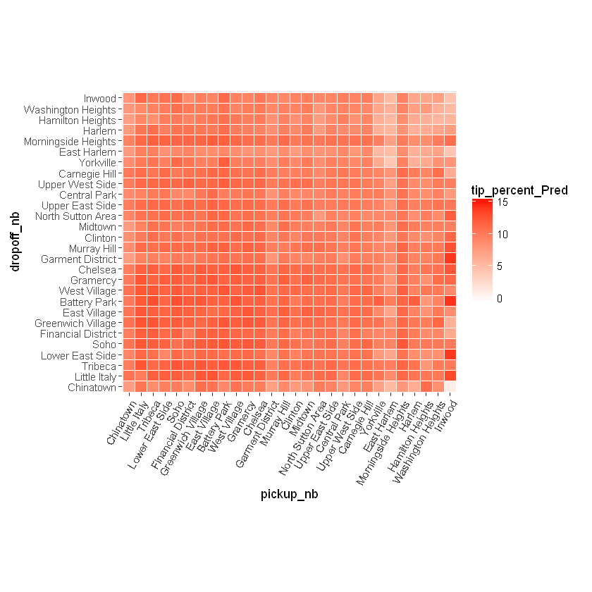
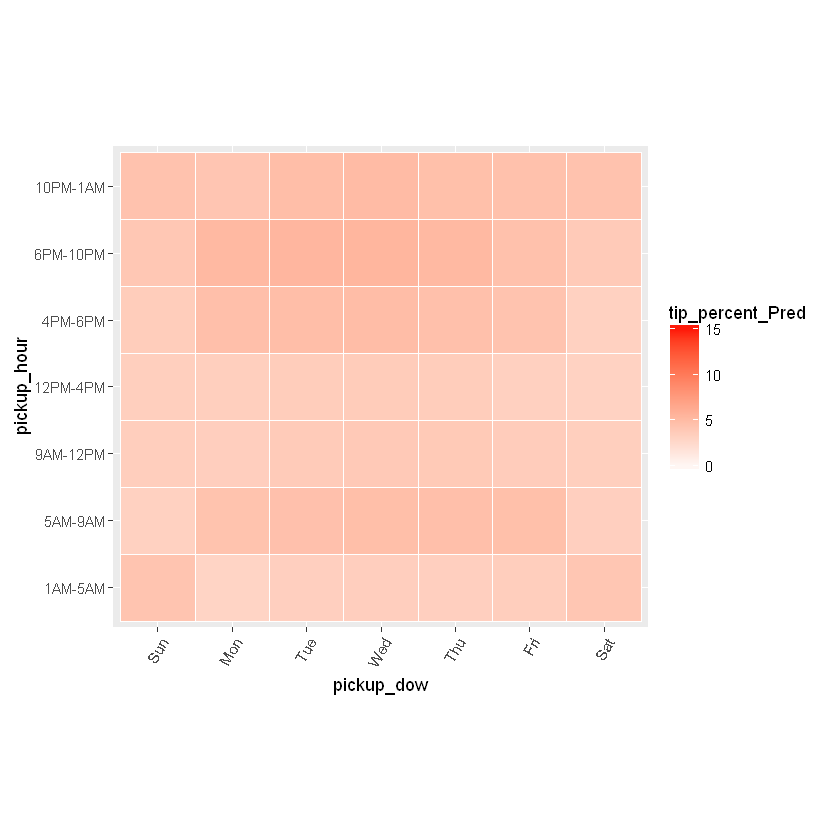
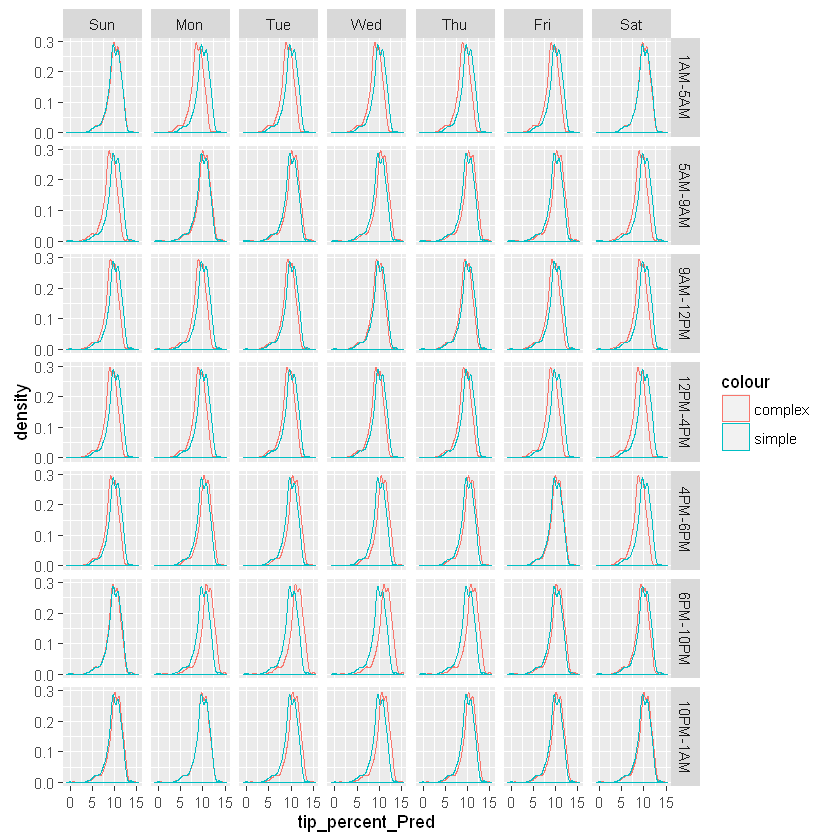
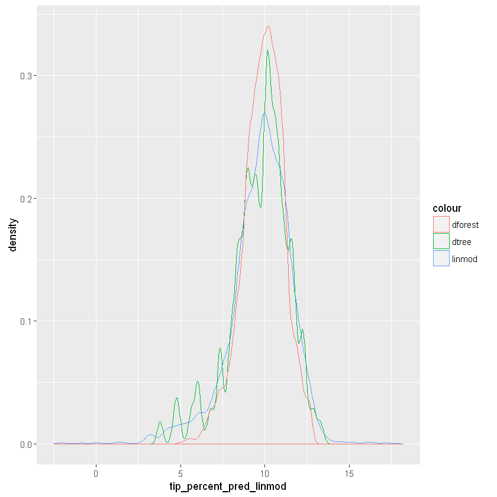

```{r setup, include=FALSE}
knitr::opts_chunk$set(echo = TRUE)
```

## Predicting tip amount

Our next exercise will consist of using several analytics functions offered by `RevoScaleR` to build models for predicting the amount customers tip for a trip. We will use the pick-up and drop-off neighborhoods and the time and day of the trip as the variables most likely to influence tip. Let's begin by building a linear model involving two interactive terms: one between `pickup_nb` and `dropoff_nb` and another one between `pickup_dow` and `pickup_hour`. The idea here is that we think trip percent is not just influenced by which neighborhood the passengers was pickup up from, or which neighborhood they were dropped off to, but which neighborhood they were picked up from AND dropped off to. Similarly, we intuit that the day of the week and the hour of the day together infulence tipping. For example, just becuase people tip high on Sundays between 9 and 12, doesn't mean that they tend to tip high any day of the week between 9 and 12PM, or any time of the day on a Sunday. This intuition is encoded in the model formula argument that we pass to the `rxLinMod` function: `tip_percent ~ pickup_nb:dropoff_nb + pickup_dow:pickup_hour` where we use `:` to separate interactive terms and `+` to separate additive terms.


```{r 6.01}
rxlm <- rxLinMod(tip_percent ~ pickup_nb:dropoff_nb + pickup_dow:pickup_hour, data = mht_xdf, dropFirst = TRUE, covCoef = TRUE)
rxs <- rxSummary( ~ pickup_nb + dropoff_nb + pickup_hour + pickup_dow, mht_xdf)
```

    Rows Processed: 31998015 
    Rows Processed: 31998015 
    

Examining the model coefficients individually is a daunting task because of how many there are. Moreover, when working with big datasets, a lot of coefficients come out as statistically significant by virtue of large sample size, without necessarily being practically significant. Instead for now we just look at how our predictions are looking. We start by extracting each variable's factor levels into a `list` which we can pass to `expand.grid` to create a dataset with all the possible combinations of the factor levels. We then use `rxPredict` to predict `tip_percent` using the above model.


```{r 6.02}
ll <- lapply(rxs$categorical, function(x) x[ , 1])
names(ll) <- c('pickup_nb', 'dropoff_nb', 'pickup_hour', 'pickup_dow')
pred_df <- expand.grid(ll)
pred_df <- rxPredict(rxlm, data = pred_df, computeStdErrors = TRUE, writeModelVars = TRUE)
head(pred_df, 10)
```

    Rows Processed: 38416 
    


We can now visualize the model's predictions by plotting the average predictions for all combinations of the interactive terms.


```{r 6.03}
ggplot(pred_df, aes(x = pickup_nb, y = dropoff_nb)) + 
  geom_tile(aes(fill = tip_percent_Pred), colour = "white") + 
  theme(axis.text.x = element_text(angle = 60, hjust = 1)) +
  scale_fill_gradient(low = "white", high = "red") + 
  coord_fixed(ratio = .9)
```





```{r 6.04}
ggplot(pred_df, aes(x = pickup_dow, y = pickup_hour)) + 
  geom_tile(aes(fill = tip_percent_Pred), colour = "white") + 
  theme(axis.text.x = element_text(angle = 60, hjust = 1)) +
  scale_fill_gradient(low = "white", high = "red") + 
  coord_fixed(ratio = .9)
```





A question we might ask ourselves is how important is the interaction between `pickup_dow` and `pickup_hour` to the predictions? How much worse would the predictions be if we only kept the interaction between `pickup_nb` and `dropoff_nb` and dropped the second interactive term? To answer this, we can build a simpler model with `rxLinMod` in which we only include `pickup_nb:dropoff_nb`. We then predict with the simpler model and use `cbind` to append the new predictions next to the data with the old predictions we made with the more complex model.


```{r 6.05}
rxlm_simple <- rxLinMod(tip_percent ~ pickup_nb:dropoff_nb, data = mht_xdf, dropFirst = TRUE, covCoef = TRUE)
pred_df_simple <- rxPredict(rxlm_simple, data = pred_df, computeStdErrors = TRUE, writeModelVars = TRUE)
names(pred_df_simple)[1:2] <- paste(names(pred_df_simple)[1:2], 'simple', sep = '_')

pred_df <- pred_df_simple %>% 
  select(starts_with('tip_percent')) %>%
  cbind(pred_df) %>%
  arrange(pickup_nb, dropoff_nb, pickup_dow, pickup_hour) %>%
  select(pickup_dow, pickup_hour, pickup_nb, dropoff_nb, starts_with('tip_percent'))

head(pred_df)
```

    Rows Processed: 31998015 
    Rows Processed: 38416 
    


We can see from the results above that the predictions with the simpler model are identical across all the days of the week and all the hours for the same pick-up and drop-off combination.  Whereas the predictions by the more complex model are unique for every combination of all four variables.  In other words, adding `pickup_dow:pickup_hour` to the model adds extra variation to the predictions, and what we'd like to know is if this variation contains important signals or if it more or less bahaves like noise. To get to the answer, we compare the distribution of the two predictions when we break them up by `pickup_dow` and `pickup_hour`.


```{r 6.06}
ggplot(data = pred_df) +
  geom_density(aes(x = tip_percent_Pred, col = "complex")) +
  geom_density(aes(x = tip_percent_Pred_simple, col = "simple")) +
  facet_grid(pickup_hour ~ pickup_dow)
```





The simpler model shows the same distribution all throughout, because these two variables have no effect on its predictions, but the more complex model shows a slightly different distribution for each combination of `pickup_dow` and `pickup_hour`, usually in the form of a slight shift in the distribution. That shift represents the effect of `pickup_dow` and `pickup_hour` at each given combination of the two variables. Because the shift is directional (not haphazard), it's safe to say that it captures some kind of important signal (although its practical significance is still up for debate).

So far we've only looked at two models from the same `rxLinMod` algorithm. When comparing the two, we looked at the way their predictions capture the effects of the variables used to build each model. To do the comparison, we built a dataset with all combinations of the variables used to build the models with, and then scored that dataset with the two models using `rxPredict`. By doing so we can see how the predictions are distributed, but we still don't know if the predictions are good. The true test of a model's performance is in its ability to predict **out of sample**, which is why we split the data in two and set aside a portion of it for model testing. 

To divide the data into training and testing portions, we first used `rxDataStep` to create a new `factor` column called `split` where each row is `"train"` or `"test"` such that a given proportion of the data (here 75 precent) is used to train a model and the rest is used to test the model's predictive power. We then used the `rxSplit` function to divide the data into the two portions. The `rx_split_xdf` function we create here combines the two steps into one and sets some arguments to defaults.


```{r 6.07}
dir.create('output', showWarnings = FALSE)
rx_split_xdf <- function(xdf = mht_xdf,
                         split_perc = 0.75,
                         output_path = "output/split",
                         ...) {
  
  # first create a column to split by
  outFile <- tempfile(fileext = 'xdf')
  rxDataStep(inData = xdf,
             outFile = xdf,
             transforms = list(
               split = factor(ifelse(rbinom(.rxNumRows, size = 1, prob = splitperc), "train", "test"))),
             transformObjects = list(splitperc = split_perc),
             overwrite = TRUE, ...)

  # then split the data in two based on the column we just created
  splitDS <- rxSplit(inData = xdf,
                     outFilesBase = file.path(output_path, "train"),
                     splitByFactor = "split",
                     overwrite = TRUE)
  
  return(splitDS)
}

# we can now split to data in two
mht_split <- rx_split_xdf(xdf = mht_xdf, varsToKeep = c('payment_type', 'fare_amount', 'tip_amount', 'tip_percent', 'pickup_hour', 'pickup_dow', 'pickup_nb', 'dropoff_nb'))
names(mht_split) <- c("train", "test")
```

    Rows Processed: 31998015 
    Rows Processed: 31998015 
    

We now run three different algorithms on the data:

  - `rxLinMod`, the linear model from earlier with the terms `tip_percent ~ pickup_nb:dropoff_nb + pickup_dow:pickup_hour`
  - `rxDTree`, the decision tree algorithm with the terms `tip_percent ~ pickup_nb + dropoff_nb + pickup_dow + pickup_hour` (decision trees don't need interactive factors because interactions are built into the algorithm itself)
  - `rxDForest`, the random forest algorithm with the same terms as decision trees
  
Since this is not a modeling course, we will not discuss how the algorthims are implemented. Instead we run the algorithms and use them to predict tip percent on the test data so we can see which one works better.


```{r 6.08}
system.time(linmod <- rxLinMod(tip_percent ~ pickup_nb:dropoff_nb + pickup_dow:pickup_hour, 
                               data = mht_split$train, reportProgress = 0))
system.time(dtree <- rxDTree(tip_percent ~ pickup_nb + dropoff_nb + pickup_dow + pickup_hour, 
                             data = mht_split$train, pruneCp = "auto", reportProgress = 0))
system.time(dforest <- rxDForest(tip_percent ~ pickup_nb + dropoff_nb + pickup_dow + pickup_hour, 
                                 mht_split$train, nTree = 10, importance = TRUE, useSparseCube = TRUE, reportProgress = 0))
```


       user  system elapsed 
       0.01    0.00    1.26 


       user  system elapsed 
       0.03    0.05  664.23 


       user  system elapsed 
       0.00    0.02  538.96 


Since running the above algorithms can take a while, it may be worth saving the models that each return.


```{r 6.09}
trained.models <- list(linmod = linmod, dtree = dtree, dforest = dforest)
save(trained.models, file = 'trained.models.Rdata')
```

Before applying the algorithm to the test data, let's apply it to the small dataset with all the combinations of categorical variables and visualize the predictions. This might help us develop some intuition about each algorithm.


```{r 6.10}
ll <- lapply(rxs$categorical, function(x) x[ , 1])
names(ll) <- c('pickup_nb', 'dropoff_nb', 'pickup_hour', 'pickup_dow')
pred_df <- expand.grid(ll)
pred_df_1 <- rxPredict(trained.models$linmod, data = pred_df, predVarNames = "tip_percent_pred_linmod")
pred_df_2 <- rxPredict(trained.models$dtree, data = pred_df, predVarNames = "tip_percent_pred_dtree")
pred_df_3 <- rxPredict(trained.models$dforest, data = pred_df, predVarNames = "tip_percent_pred_dforest")
pred_df <- do.call(cbind, list(pred_df, pred_df_1, pred_df_2, pred_df_3))
head(pred_df)

ggplot(data = pred_df) +
  geom_density(aes(x = tip_percent_pred_linmod, col = "linmod")) +
  geom_density(aes(x = tip_percent_pred_dtree, col = "dtree")) +
  geom_density(aes(x = tip_percent_pred_dforest, col = "dforest")) # + facet_grid(pickup_hour ~ pickup_dow)
```

    Rows Processed: 38416 
    Rows Processed: 38416 
    Rows Processed: 38416 
    





Both the linear model and the random forest give us smooth predictions. We can see that the random forest predictions are the most concentrated. The predictions for the decision tree follow a jagged distribution, probably as a result of overfitting, but we don't know that until we check preformance against the test set.

We now apply the model to the test data so we can compare the predictive power of each model. If we are correct about the decision tree overfitting, then we should see it preform poorly on the test data compared to the other two models. If we believe the random forest captures some inherent signals in the data that the linear model misses, we should see it perform better than the linear model on the test data.


```{r 6.11}
rxPredict(trained.models$linmod, data = mht_split$test, outData = mht_split$test, predVarNames = "tip_percent_pred_linmod", overwrite = TRUE)
rxPredict(trained.models$dtree, data = mht_split$test, outData = mht_split$test, predVarNames = "tip_percent_pred_dtree", overwrite = TRUE)
rxPredict(trained.models$dforest, data = mht_split$test, outData = mht_split$test, predVarNames = "tip_percent_pred_dforest", overwrite = TRUE)

rxSummary(~ SSE_linmod + SSE_dtree + SSE_dforest, data = mht_split$test,
          transforms = list(SSE_linmod = (tip_percent - tip_percent_pred_linmod)^2,
                            SSE_dtree = (tip_percent - tip_percent_pred_dtree)^2,
                            SSE_dforest = (tip_percent - tip_percent_pred_dforest)^2))
```

    Rows Processed: 24003751 
    Rows Processed: 24003751 
    Rows Processed: 24003751 
    Rows Processed: 24003751 
    


    Call:
    rxSummary(formula = ~SSE_linmod + SSE_dtree + SSE_dforest, data = mht_split$test, 
        transforms = list(SSE_linmod = (tip_percent - tip_percent_pred_linmod)^2, 
            SSE_dtree = (tip_percent - tip_percent_pred_dtree)^2, 
            SSE_dforest = (tip_percent - tip_percent_pred_dforest)^2))
    
    Summary Statistics Results for: ~SSE_linmod + SSE_dtree + SSE_dforest
    Data: mht_split$test (RxXdfData Data Source)
    File name: C:\Data\NYC_taxi\output\split\train.split.train.xdf
    Number of valid observations: 24003751 
     
     Name        Mean     StdDev   Min                    Max      ValidObs MissingObs
     SSE_linmod  82.97691 109.4821 0.00000000000248315989 8786.950 24003751 0         
     SSE_dtree   82.73915 109.5350 0.00000587611335319103 8898.893 24003751 0         
     SSE_dforest 82.83703 108.1598 0.00000000000003121173 8643.967 24003751 0         


All models did surprisingly well. This could be an indication that we still have a lot of left-over signal to capture, i.e. the model is **underfitting**. This makes sense, given that there are still a lot of important columns in the data that we left out of the models, such as `payment_type` which has a strong influence on `tip_percent`. We can use RMSE (the square root of the numbers under the `Mean` column above) to compare the models with each other, we don't know how well they do predicting in the first place. So let's also look at the correlation between `tip_percent` and each of the models' predictions.


```{r 6.12}
rxc <- rxCor( ~ tip_percent + tip_percent_pred_linmod + tip_percent_pred_dtree + tip_percent_pred_dforest, data = mht_split$test)
print(rxc)
```

    Rows Processed: 24003751 
                             tip_percent tip_percent_pred_linmod tip_percent_pred_dtree tip_percent_pred_dforest
    tip_percent                1.0000000               0.1402579              0.1499408                0.1494418
    tip_percent_pred_linmod    0.1402579               1.0000000              0.8645227                0.9089591
    tip_percent_pred_dtree     0.1499408               0.8645227              1.0000000                0.9321950
    tip_percent_pred_dforest   0.1494418               0.9089591              0.9321950                1.0000000
    

The correlation numbers are somewhat disappointing: as we can see the predictions from our model are not as well as expected. There can be different reasons our predictions are not very accurate, some apply across the board (such as having data that hasn't been properly cleaned, or leaving out important variables), and others are model-specific (for example, linear models can be sensetive to outliers while tree-based models are not). We examine such assumptions more thoroughly in our modeling course, as well as ways that we can improve our models, in another course.

## Conclusion

The modeling examples shown above are very basic and intended to showcase how the analytics algorithms work. For a more in-depth knowledge of how to build models, tune parameters, and test models using methods such as **cross validation**, we encourage you to take our *Modeling with MRS* course.

Throughout this course we learned how to use `RevoScaleR` and its capabilities to do big data analysis, and how to leverage R's functionality as offered in the `base` package or any third-party packages in `RevoScaleR`. See you next time.

